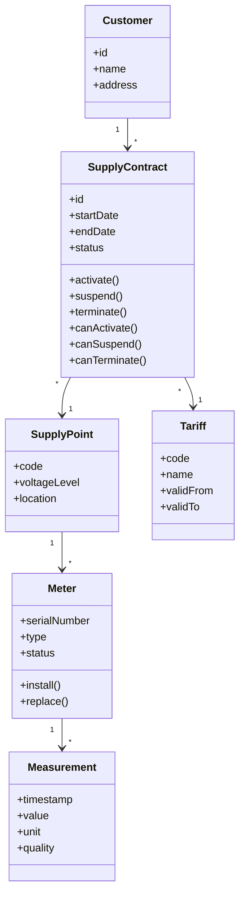
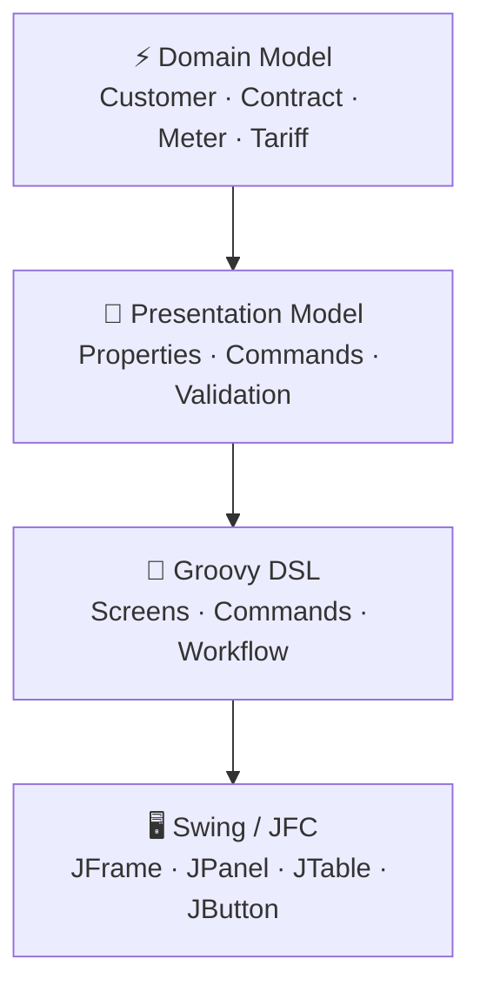
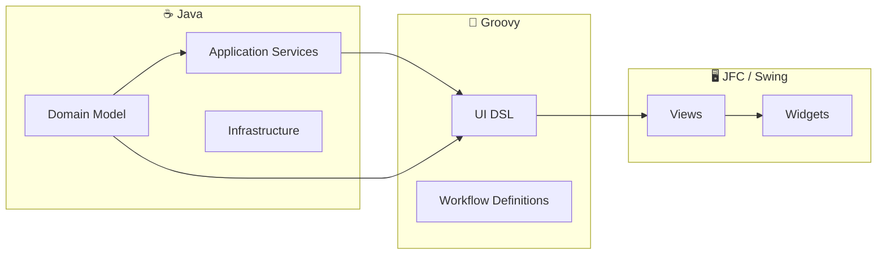
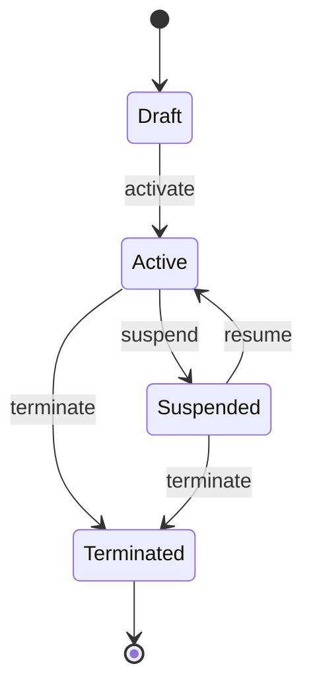
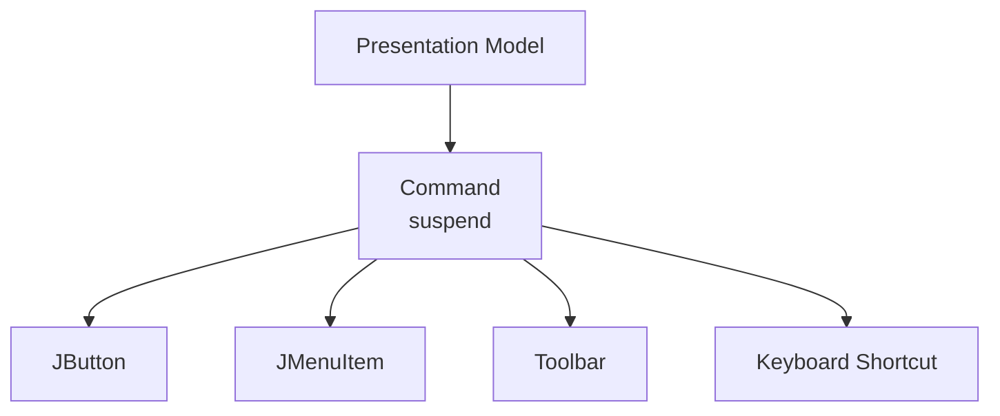
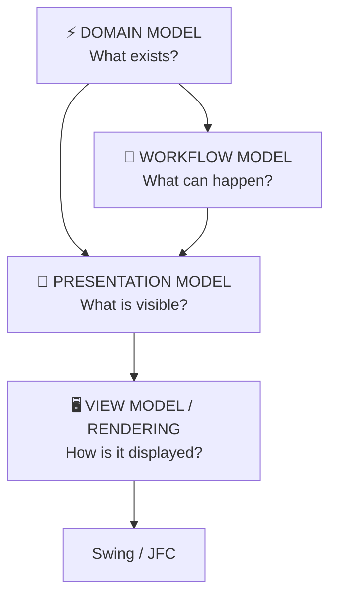

# When Swing Met the Grid ⚡

## Part I — A 2009 experiment in declarative UI, Groovy and energy-domain modeling

> *What if Swing were only the renderer?*

Back around **2009**, while working with Java 1.4/1.5 and Swing/JFC, I had the slightly heretical idea of describing UI workflows with a **Groovy DSL**.

At first glance it sounds like:

> "Let's write Swing in Groovy."

But that's not really the interesting idea.

The interesting idea is:

> **Don't describe widgets. Describe the interaction model.**

And an **Energy & Utilities** domain is almost an ideal laboratory for this.

You don't merely have objects.

You have:

* customers;
* contracts;
* supply points;
* meters;
* tariffs;
* measurements;
* network assets;
* outages;
* work orders;
* inspections;
* state transitions;
* temporal validity;
* permissions;
* operational constraints.

In other words:

**lots of objects + lots of state + lots of legal/illegal transitions = UI workflow hell.**

Unless you model it.

---

# 1. The classic Swing problem 🫠

Swing itself is not the problem.

Swing is actually a rather sophisticated toolkit.

The problem appears when the application starts mixing:

```text
domain logic
     +
presentation logic
     +
navigation
     +
validation
     +
event handling
     +
widget manipulation
```

inside the same Java classes.

You start with something innocent:

```java
JButton activate = new JButton("Activate");
```

Then:

```java
activate.addActionListener(...);
```

Then:

```java
activate.setEnabled(...);
```

Then:

```java
customerField.getDocument().addDocumentListener(...);
```

Then:

```java
if (...) {
    JOptionPane.showMessageDialog(...);
}
```

Then:

```java
cardLayout.show(container, "active");
```

Then somebody adds:

```java
refreshMeterTable();
```

And six months later:

```text
                JFrame
                  │
        ┌─────────┼─────────┐
        ▼         ▼         ▼
     JPanel     JTable    JButton
        │         │         │
        ▼         ▼         ▼
    Listener   Listener   Listener
        │         │         │
        └────┬────┴────┬────┘
             ▼         ▼
        Controller   Controller
             │         │
             └────┬────┘
                  ▼
             Domain Model
```

The architecture hasn't necessarily *failed*.

It has simply become **implicit**.

And implicit architecture is difficult to reason about.

---

# 2. Enter the Energy domain ⚡

Let's take a deliberately simplified utility domain.



This is obviously simplified.

Real utility systems can become substantially more interesting:

```text
Customer
   │
   ├── Contract
   │      │
   │      ├── Tariff
   │      ├── PricingComponent
   │      ├── ValidityPeriod
   │      └── SupplyPoint
   │
   └── BillingAccount
          │
          ├── Invoice
          └── Payment
```

Meanwhile:

```text
SupplyPoint
   │
   ├── Meter
   ├── NetworkConnection
   ├── Measurements
   └── OutageHistory
```

This is where the **OO model** starts earning its keep.

The domain isn't a database table.

It has behavior.

---

# 3. A contract is not a record

This distinction is fundamental.

A database-oriented UI might think:

```text
SUPPLY_CONTRACT

id
customer_id
tariff_id
start_date
end_date
status
```

Therefore:

> "Let's generate a form."

But the domain model says:

```java
contract.activate();
contract.suspend();
contract.resume();
contract.terminate();
```

And those operations aren't necessarily always legal.

For example:

```text
DRAFT
  │
  │ activate()
  ▼
ACTIVE
  │
  ├── suspend() ──► SUSPENDED
  │                    │
  │                    └── resume() ──► ACTIVE
  │
  └── terminate() ──► TERMINATED
```

That is a **behavioral model**.

The UI should reflect it.

---

# 4. The first architectural move 🧱

Rather than:

```text
Domain Object
     ↓
Swing Widgets
```

introduce an intermediate representation.



This is the crucial separation.

The **domain model** answers:

> What is an energy contract?

The **presentation model** answers:

> What does the operator need to see and manipulate?

The **DSL** answers:

> What interaction is possible here?

Swing answers:

> How do I paint this thing on the screen?

Four different questions.

Four different responsibilities.

---

# 5. The Presentation Model 🧠

Suppose we introduce:

```java
class ContractPresentationModel {

    private SupplyContract contract;

    String getCustomerName() {
        return contract.getCustomer().getName();
    }

    String getSupplyPointCode() {
        return contract.getSupplyPoint().getCode();
    }

    String getTariffName() {
        return contract.getTariff().getName();
    }

    boolean canSuspend() {
        return contract.canSuspend();
    }

    void suspend() {
        contract.suspend();
    }
}
```

Notice what's happening.

The Swing layer doesn't need to understand this:

```text
Customer
   └── Contract
          └── SupplyPoint
                 └── NetworkConnection
```

It gets a presentation-oriented surface:

```text
ContractPresentationModel
 ├── customerName
 ├── supplyPointCode
 ├── tariffName
 ├── status
 ├── canSuspend
 └── suspend()
```

That's dramatically easier to bind to a GUI.

---

# 6. The UI becomes a projection 🪞

The GUI can now be thought of as:

```text
          DOMAIN
             │
             ▼
       PRESENTATION
             │
             ▼
          PROJECTION
             │
             ▼
          SWING UI
```

A possible screen:

```text
┌───────────────────────────────────────────────┐
│ ⚡ SUPPLY CONTRACT                            │
├───────────────────────────────────────────────┤
│                                               │
│ Customer       ACME Industries                │
│ Supply Point   IT001E12345678                 │
│ Tariff         Industrial T2                  │
│ Status         ● ACTIVE                       │
│                                               │
│ ┌───────────┐  ┌────────────┐ ┌────────────┐ │
│ │  Suspend  │  │ Measurements│ │ Change     │ │
│ │           │  │             │ │ Tariff     │ │
│ └───────────┘  └────────────┘ └────────────┘ │
│                                               │
└───────────────────────────────────────────────┘
```

The buttons are no longer arbitrary UI controls.

They correspond to **domain/application commands**.

That distinction matters.

---

# 7. What if we declared this? 🧙

Instead of Java:

```java
JButton suspend = new JButton("Suspend");

suspend.addActionListener(
    new ActionListener() {
        public void actionPerformed(ActionEvent e) {
            ...
        }
    }
);
```

imagine:

```groovy
screen "SupplyContract" {

    field "customer" {
        label "Customer"
        bind "customerName"
    }

    field "supplyPoint" {
        label "Supply Point"
        bind "supplyPointCode"
    }

    field "tariff" {
        label "Tariff"
        bind "tariffName"
    }

    status "status" {
        bind "status"
    }

    command "suspend" {
        label "Suspend"

        enabledWhen {
            model.canSuspend()
        }

        action {
            model.suspend()
        }
    }
}
```

💡 **This is the moment where it stops being "Groovy Swing code".**

It has become a language.

A tiny one.

But a language nonetheless.

---

# 8. An internal DSL

The interesting property is that this doesn't require building a parser.

Groovy already gives us:

* closures;
* dynamic dispatch;
* builders;
* method calls without parentheses;
* maps;
* lists;
* metaprogramming.

So:

```groovy
field "customer" {
    label "Customer"
    bind "customerName"
}
```

can become ordinary Groovy calls.

Conceptually:

```text
Groovy source
      │
      ▼
   AST / runtime
      │
      ▼
DSL builder objects
      │
      ▼
ScreenDefinition
      │
      ▼
Swing renderer
```

The DSL is therefore an **internal DSL**.

No parser generator.

No XML schema.

No giant configuration framework.

Just:

```text
Groovy + objects + closures
```

KISS. 😎

---

# 9. But why not XML?

In 2009 this was a very reasonable question.

You could describe a screen using XML:

```xml
<screen name="SupplyContract">

    <field name="customer"
           bind="customerName"/>

    <field name="tariff"
           bind="tariffName"/>

    <command name="suspend"/>

</screen>
```

Perfectly possible.

But the moment you want:

```text
enabled when ...
validate ...
execute ...
navigate ...
```

XML starts becoming:

```xml
<enabledWhen>
    <expression>
        ...
    </expression>
</enabledWhen>
```

😵

Groovy gives you executable expressions naturally:

```groovy
enabledWhen {
    model.canSuspend()
}
```

And suddenly your configuration language has access to the host language.

That's the DSL sweet spot.

---

# 10. The domain stays Java 🛡️

And this is important historically.

I wouldn't replace Java with Groovy.

I'd use:

```text
Java
 └── domain
 └── services
 └── persistence
 └── infrastructure

Groovy
 └── presentation DSL
 └── workflow definitions

Swing
 └── rendering
```

So:



That's a very reasonable architecture for the Java ecosystem of the time.

---

# 11. Now the interesting bit: workflow

The previous example only described a screen.

But utility applications are fundamentally **workflow-heavy**.

Let's take a supply contract.



The DSL can express exactly that:

```groovy
workflow "SupplyContract" {

    state "draft" {

        screen "ContractEditor"

        command "activate" {

            enabledWhen {
                model.canActivate()
            }

            validate {
                required model.customer
                required model.supplyPoint
                required model.tariff
            }

            action {
                model.activate()
            }

            goto "active"
        }
    }

    state "active" {

        screen "ActiveContract"

        command "suspend" {

            enabledWhen {
                model.canSuspend()
            }

            action {
                model.suspend()
            }

            goto "suspended"
        }

        command "terminate" {

            enabledWhen {
                model.canTerminate()
            }

            confirm "Terminate supply contract?"

            action {
                model.terminate()
            }

            goto "terminated"
        }
    }

    state "suspended" {

        screen "SuspendedContract"

        command "resume" {

            action {
                model.resume()
            }

            goto "active"
        }
    }

    state "terminated" {
        screen "TerminatedContract"
    }
}
```

Now we have something much more interesting:

```text
SCREEN
+
COMMAND
+
GUARD
+
VALIDATION
+
ACTION
+
TRANSITION
```

That's a **UI workflow language**.

---

# 12. And suddenly testing changes 🧪

Traditional Swing testing might mean:

```text
find button
   ↓
click button
   ↓
wait
   ↓
inspect widget
   ↓
find another widget
   ↓
assert text
```

Our workflow can instead be tested semantically:

```groovy
given:

    contract.status == ACTIVE

when:

    workflow.fire("suspend")

then:

    contract.status == SUSPENDED
```

The test doesn't care whether the renderer uses:

```text
JButton
JMenuItem
toolbar
keyboard shortcut
context menu
```

The semantic command is:

```text
suspend
```

That's a much better abstraction boundary.

---

# 13. The command is the real UI primitive

This leads to a subtle idea.

Maybe the fundamental UI object isn't:

```text
JButton
```

but:

```text
Command
```

A command has:

```text
name
label
icon
enabled
visible
permission
guard
validation
action
transition
```

Then Swing merely renders it.



One semantic command.

Multiple physical representations.

That's a powerful idea.

---

# 14. The same domain can have multiple UIs

And this is where the architecture starts to pay dividends.

Imagine:

```text
                   SupplyContract
                         │
                         ▼
                 Presentation Model
                         │
              ┌──────────┼──────────┐
              ▼          ▼          ▼
           Swing       Web UI     Mobile
```

The domain doesn't know about any of them.

The command:

```text
suspend
```

is still:

```text
suspend
```

Whether represented as:

```text
[JButton Suspend]
```

or:

```text
POST /contracts/123/suspend
```

or:

```text
📱 Suspend
```

is a presentation concern.

That is the real value of separating the models.

---

# 15. Why Energy & Utilities is a particularly good example ⚡

This isn't just a contrived enterprise example.

Utility domains tend to have exactly the characteristics that make workflow-oriented presentation useful:

### Temporal state

```text
validFrom
validTo
effectiveDate
settlementPeriod
```

### State

```text
planned
active
suspended
terminated
```

### Commands

```text
activate
suspend
resume
terminate
replace
approve
reject
dispatch
restore
```

### Guards

```text
canActivate()
canSuspend()
canTerminate()
```

### Roles

```text
operator
dispatcher
administrator
customer-service
field-engineer
```

### Measurements

```text
timestamp
value
unit
quality
source
```

### Constraints

```text
contract validity
meter compatibility
network constraints
tariff validity
authorization
```

That is almost a checklist for a workflow DSL.

---

# 16. A 2009 architecture 🕰️

If we freeze the technology around 2009:

```text
┌─────────────────────────────────────────────┐
│                 JAVA 1.4 / 1.5              │
├─────────────────────────────────────────────┤
│                                             │
│   ⚡ DOMAIN                                  │
│   Customer / Contract / Meter / Tariff      │
│                                             │
│                 ↓                           │
│                                             │
│   APPLICATION SERVICES                      │
│                                             │
├─────────────────────────────────────────────┤
│                 GROOVY                      │
├─────────────────────────────────────────────┤
│                                             │
│   Presentation Model                        │
│   Workflow DSL                              │
│                                             │
├─────────────────────────────────────────────┤
│                  SWING                      │
├─────────────────────────────────────────────┤
│                                             │
│   JFrame / JPanel / JTable / JButton        │
│                                             │
└─────────────────────────────────────────────┘
```

And that is the thing I find interesting retrospectively.

The proposal wasn't:

> "Groovy is cooler than Java."

It was:

> **"Use a dynamic language to describe a semantic layer that Java's type system and Swing's widget model don't express particularly well."**

That's a much more defensible proposition.

---

# 17. The DSL is a little compiler 🧙‍♂️

Push the metaphor further.

The Groovy DSL is essentially compiling:

```groovy
command "suspend" {
    enabledWhen { model.canSuspend() }

    action {
        model.suspend()
    }

    goto "suspended"
}
```

into something like:

```text
CommandDefinition
        │
        ├── id = suspend
        ├── guard = Closure
        ├── action = Closure
        └── target = suspended
```

Then:

```text
CommandDefinition
        │
        ▼
WorkflowEngine
        │
        ▼
PresentationModel
        │
        ▼
Swing
```

So:

```text
          source
            │
            ▼
       Groovy DSL
            │
            ▼
   intermediate model
            │
            ▼
       interpreter
            │
            ▼
          Swing
```

That is almost a tiny compiler architecture.

Except the target isn't machine code.

It's **interaction**.

---

# 18. The punchline 🎯

Looking back at a 2009 Java/Swing application, I would therefore distinguish four different models:



And this gives us a rather elegant division:

| Model        | Question                      |
| ------------ | ----------------------------- |
| Domain       | **What is true?**             |
| Presentation | **What should the user see?** |
| Workflow     | **What can the user do?**     |
| View         | **How is it rendered?**       |

That's the architecture I would have been aiming at.

Not:

> **"Let's make Swing declarative."**

But:

> ⚡ **"Let's make the application's interaction semantics declarative, and let Swing render them."**

That is a much more interesting proposition.

And perhaps the most 2009 part of the whole thing is that **Groovy was a remarkably pragmatic way of doing it**: dynamic enough to make the DSL pleasant, but still able to call directly into the Java 1.4/1.5 world.

The widgets become the *backend*.

The DSL becomes the *language*.

And the energy domain remains the *source of truth*.

**That's when Swing met the grid.** ⚡
