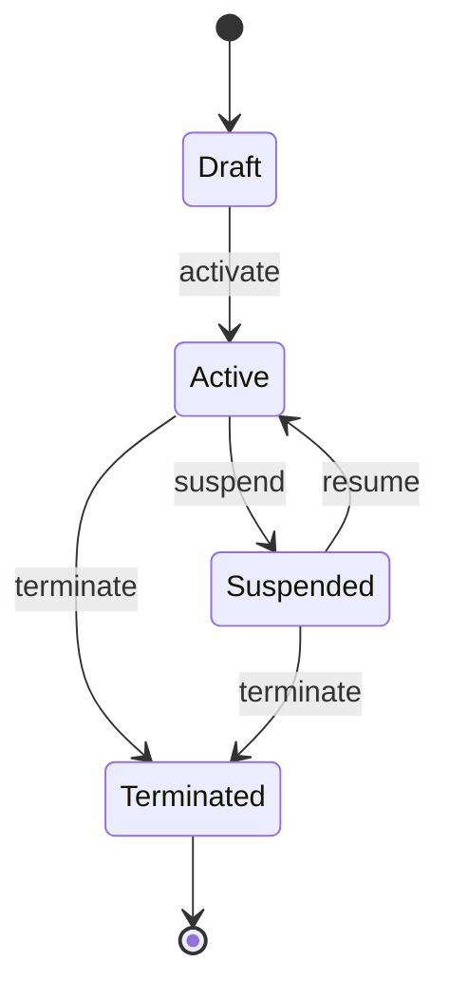
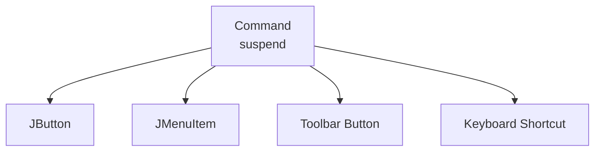
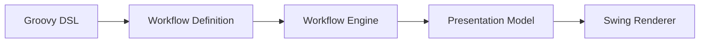
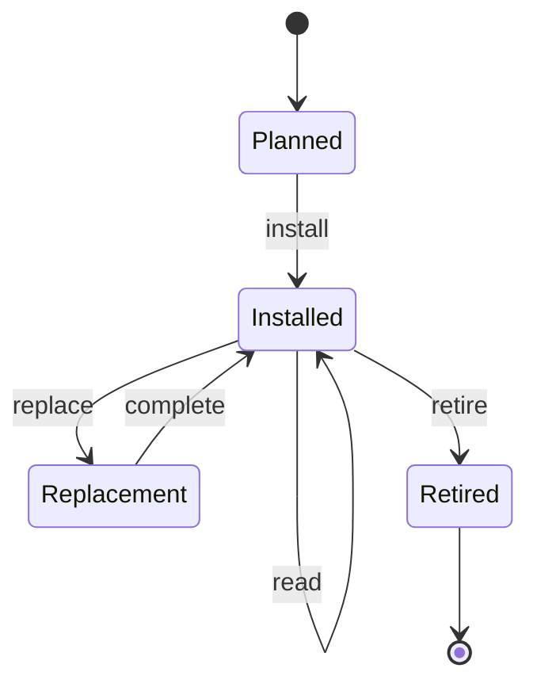
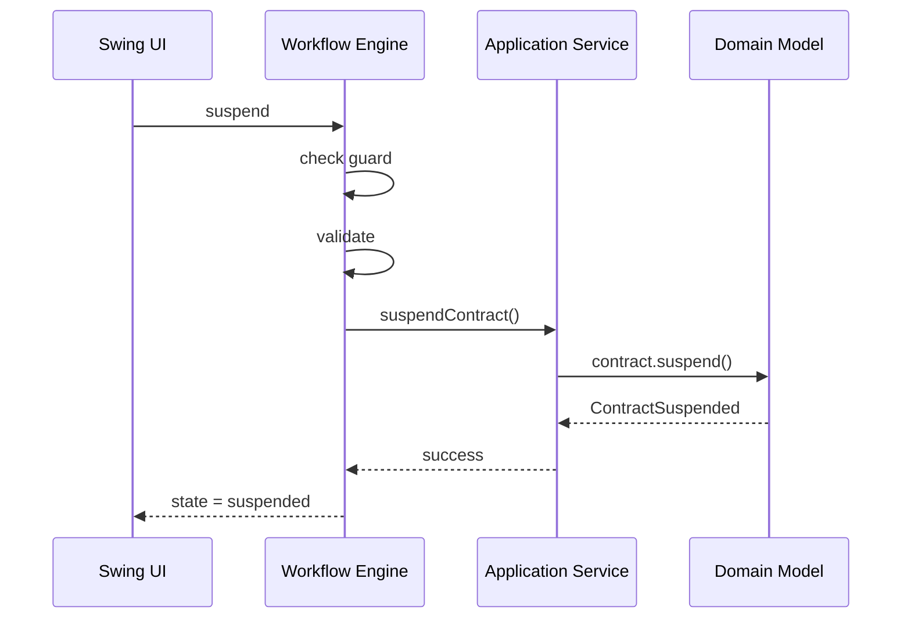
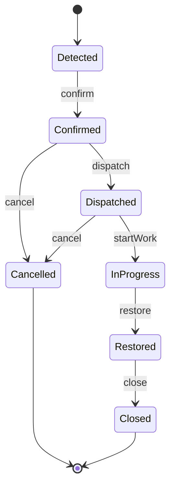
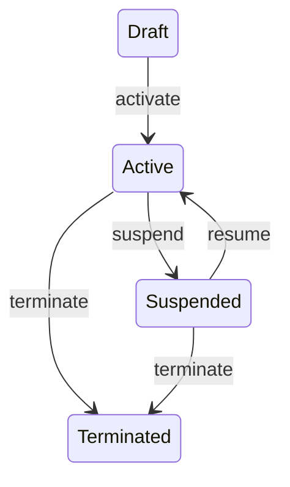
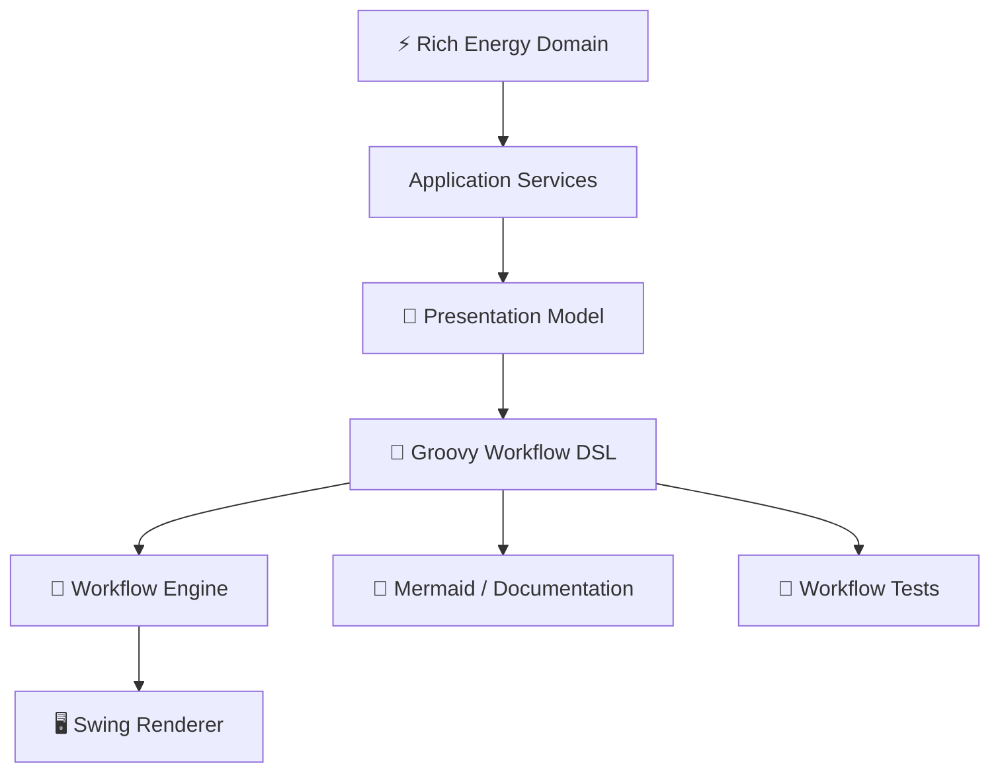
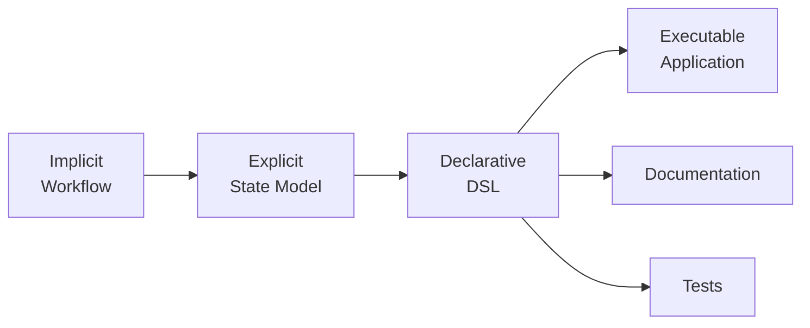

---

layout: post
title: "A Bit of history – Part 2 – The Grid Is a State Machine ⚡"
subtitle: "Modeling Energy & Utilities workflows with a Groovy DSL"
date: 2026-08-25
categories:
- software-architecture
tags:
- java
- swing
- jfc
- groovy
- dsl
- workflow
- state-machine
- declarative-ui
- model-driven-ui
- energy
- utilities
excerpt: "From supply contracts and meters to outages: expressing state, guards, validation and transitions as a declarative UI workflow."

---

# The Grid Is a State Machine ⚡

## Part II — Modeling Energy & Utilities workflows with a Groovy DSL

In Part I, we made a fairly radical move:

> **Swing is not the UI architecture. Swing is the renderer.**

The application has a richer structure:

```text
⚡ Domain Model
       │
       ▼
🧠 Presentation Model
       │
       ▼
🧙 Groovy DSL
       │
       ▼
🖥 Swing / JFC
```

But there's another problem hiding underneath.

A utility application isn't just a collection of screens.

It's a collection of **legal state transitions**.

A supply contract can be activated.

A meter can be installed.

An outage can be dispatched.

A work order can be closed.

And importantly:

> **Not every action is legal in every state.**

That's where things get interesting.

---

# 1. Objects are not enough 🧩

Consider a `SupplyContract`.

A naive OO model might start with:

```java
class SupplyContract {

    Customer customer;
    SupplyPoint supplyPoint;
    Tariff tariff;

    Date startDate;
    Date endDate;

    ContractStatus status;
}
```

Fine.

But the interesting part isn't the attributes.

It's the **behavior**:

```java
contract.activate();
contract.suspend();
contract.resume();
contract.terminate();
```

Each operation changes the state of the object.

So instead of thinking:

```text
SupplyContract = data
```

we should think:

```text
SupplyContract = state + behavior + invariants
```

Or, more formally:

```text
S × E → S'
```

where:

* `S` = current state
* `E` = event/command
* `S'` = resulting state

That is a state machine.

---

# 2. The contract lifecycle ⚡

Let's draw the obvious one first:



This tiny diagram already tells us something that a class diagram doesn't:

```text
Draft
  │
  └── activate ──► Active
                     │
                     ├── suspend ──► Suspended
                     │                  │
                     │                  └── resume ──► Active
                     │
                     └── terminate ──► Terminated
```

The graph is the workflow.

The screen is merely a projection of the current node.

---

# 3. UI buttons are really transitions 🔘

This is a useful mental inversion.

The traditional Swing approach starts with:

```text
JButton
   │
   ▼
ActionListener
   │
   ▼
business operation
```

Our approach starts with:

```text
business command
       │
       ▼
workflow transition
       │
       ▼
presentation command
       │
       ▼
JButton
```

In other words:

> **The button is not the command.**

The button is one possible representation of the command.



This is a surprisingly important distinction.

Once `suspend` exists as a first-class command, it can be rendered in multiple ways.

---

# 4. The workflow DSL 🧙‍♂️

Now let's encode the state machine.

A deliberately Groovy-ish DSL could look like this:

```groovy
workflow "SupplyContract" {

    state "draft" {

        screen "ContractEditor"

        command "activate" {

            enabledWhen {
                model.canActivate()
            }

            validate {
                required model.customer
                required model.supplyPoint
                required model.tariff
            }

            action {
                model.activate()
            }

            goto "active"
        }
    }

    state "active" {

        screen "ActiveContract"

        command "suspend" {

            enabledWhen {
                model.canSuspend()
            }

            action {
                model.suspend()
            }

            goto "suspended"
        }

        command "terminate" {

            enabledWhen {
                model.canTerminate()
            }

            confirm "Terminate supply contract?"

            action {
                model.terminate()
            }

            goto "terminated"
        }
    }

    state "suspended" {

        screen "SuspendedContract"

        command "resume" {

            enabledWhen {
                model.canResume()
            }

            action {
                model.resume()
            }

            goto "active"
        }
    }

    state "terminated" {

        screen "TerminatedContract"
    }
}
```

Look at what has disappeared.

There is no:

```text
JButton
ActionListener
CardLayout
JPanel
setEnabled()
show()
```

The DSL describes **semantics**.

---

# 5. The DSL is executable architecture

This isn't merely configuration.

Consider:

```groovy
enabledWhen {
    model.canSuspend()
}
```

That's executable behavior.

Or:

```groovy
action {
    model.suspend()
}
```

Again, executable.

Or:

```groovy
goto "suspended"
```

That's a workflow transition.

So the DSL is really a small **programming language for interaction**.



And this is why Groovy makes sense.

We don't need to invent a parser.

The host language already gives us:

```text
closures
method calls
objects
maps
lists
dynamic dispatch
metaprogramming
```

The syntax becomes almost language-like.

---

# 6. Guards: where domain semantics meet UI 🛡️

A workflow needs guards.

For example:

```groovy
command "activate" {

    enabledWhen {
        model.canActivate()
    }

    action {
        model.activate()
    }

    goto "active"
}
```

The UI doesn't need to know *why* activation isn't possible.

It asks:

```text
canActivate() ?
```

The domain/application layer can decide:

```text
customer exists?
supply point valid?
tariff valid?
start date valid?
meter available?
contract not already active?
operator authorized?
```

The presentation layer merely exposes the result.

This is a crucial separation:

```text
             WHY?
              │
              ▼
       Domain / Application
              │
              │ canActivate()
              ▼
            Boolean
              │
              ▼
             UI
```

The Swing layer should not reconstruct business rules.

---

# 7. Validation is not the same as a guard

This is another subtle distinction.

A **guard** answers:

> Can this command be executed?

Validation answers:

> What is wrong with the current input?

For example:

```groovy
command "activate" {

    enabledWhen {
        model.canActivate()
    }

    validate {

        required model.customer

        required model.supplyPoint

        required model.tariff

        validDateRange(
            model.startDate,
            model.endDate
        )
    }

    action {
        model.activate()
    }

    goto "active"
}
```

So:

```text
Guard
  │
  └── command available?

Validation
  │
  └── input acceptable?

Action
  │
  └── perform operation

Transition
  │
  └── new workflow state
```

Four different concepts.

That's already enough to prevent a lot of Swing spaghetti.

---

# 8. The workflow engine 🧠

Behind the DSL, the runtime doesn't need to be particularly complicated.

Conceptually:

```java
class WorkflowEngine {

    State currentState;

    void fire(String command) {

        Command c =
            currentState.getCommand(command);

        if (!c.isEnabled(model))
            throw new IllegalStateException();

        c.validate(model);

        c.execute(model);

        currentState =
            c.getTargetState();
    }
}
```

The important thing is that the workflow definition becomes data:

```text
Workflow
 ├── State
 │    ├── Screen
 │    └── Command
 │          ├── Guard
 │          ├── Validation
 │          ├── Action
 │          └── Target
 └── State
```

Which means it can be inspected.

Logged.

Tested.

Visualized.

Potentially even edited with tooling.

---

# 9. Now add meters 🔌

Meters have their own lifecycle.



The corresponding DSL:

```groovy
workflow "Meter" {

    state "planned" {

        screen "MeterInstallation"

        command "install" {

            validate {
                required model.serialNumber
                required model.location
            }

            action {
                model.install()
            }

            goto "installed"
        }
    }

    state "installed" {

        screen "MeterDashboard"

        command "read" {

            action {
                model.takeReading()
            }
        }

        command "replace" {

            action {
                model.startReplacement()
            }

            goto "replacement"
        }

        command "retire" {

            action {
                model.retire()
            }

            goto "retired"
        }
    }

    state "replacement" {

        screen "MeterReplacement"

        command "complete" {

            action {
                model.completeReplacement()
            }

            goto "installed"
        }
    }

    state "retired" {

        screen "RetiredMeter"
    }
}
```

Notice that `read` doesn't transition anywhere.

That's perfectly legitimate.

A workflow doesn't have to be:

```text
state → transition → state
```

It can also have:

```text
state → command → side effect
```

This distinction becomes useful for operational applications.

---

# 10. Commands versus events 📡

There's another useful distinction.

A **command** says:

> Please do this.

An **event** says:

> This happened.

For example:

```text
COMMAND
────────
suspendContract
```

versus:

```text
EVENT
─────
ContractSuspended
```

The workflow might therefore look conceptually like:



This is beginning to look much less like a GUI framework and much more like an **application protocol**.

And that's exactly where this architecture gets interesting.

---

# 11. Outage management 🚨

Energy & Utilities gives us an even better example.

Imagine:



The UI isn't just a collection of forms.

It is an operational process:

```text
🚨 detected
   ↓
🔎 confirmed
   ↓
🚚 dispatched
   ↓
🔧 work in progress
   ↓
⚡ restored
   ↓
✅ closed
```

And each state can expose a different presentation.

```text
Detected
   → OutageAlert

Confirmed
   → OutageDetails

Dispatched
   → CrewTracking

InProgress
   → WorkConsole

Restored
   → RestorationVerification

Closed
   → OutageSummary
```

The workflow model therefore becomes the skeleton of the application.

---

# 12. Role-based commands 👷

Now add authorization.

```groovy
command "dispatch" {

    requires role "DISPATCHER"

    enabledWhen {
        model.canDispatch()
    }

    action {
        model.dispatch()
    }

    goto "dispatched"
}
```

Another command:

```groovy
command "restore" {

    requires role "FIELD_ENGINEER"

    enabledWhen {
        model.canRestore()
    }

    action {
        model.restore()
    }

    goto "restored"
}
```

The command now has another dimension:

```text
Command
 ├── availability
 ├── authorization
 ├── validation
 ├── action
 └── transition
```

That's useful because **visibility, enablement and authorization aren't necessarily the same thing**.

A command could be:

```text
visible = true
enabled = false
authorized = true
```

or:

```text
visible = false
authorized = false
```

A mature DSL should eventually distinguish these.

---

# 13. Temporal constraints ⏱️

And utility domains have another particularly nasty characteristic:

**time**.

A tariff might be valid only during:

```text
2026-01-01 → 2026-12-31
```

A contract may have:

```text
startDate
endDate
```

A measurement belongs to an interval.

A meter reading may be:

```text
actual
estimated
validated
corrected
```

So a guard might become:

```groovy
enabledWhen {

    model.tariff.validAt(model.startDate) &&
    model.supplyPoint.operationalAt(model.startDate)
}
```

Now our "UI DSL" is asking domain questions.

That's okay.

It should **ask** the domain.

It shouldn't **implement** the domain.

---

# 14. The boundary 🧱

This is the architectural line I'd defend very strongly:

```text
                    UI DSL
                       │
              ┌────────┴────────┐
              │                 │
           ASK DOMAIN        DECLARE UI
              │                 │
              ▼                 ▼
       canActivate()         screen(...)
       canSuspend()          command(...)
       canTerminate()        goto(...)
              │                 │
              ▼                 ▼
         DOMAIN MODEL       PRESENTATION
```

Bad:

```groovy
enabledWhen {
    model.customer.balance > 1000 &&
    model.meter.type == "A" &&
    model.tariff.code == "T2" &&
    ...
}
```

Better:

```groovy
enabledWhen {
    model.canSuspend()
}
```

The DSL shouldn't become a second domain model.

---

# 15. A workflow is a graph 🕸️

Once the workflow is explicit, we can represent it mathematically.

Let:

```text
W = (S, C, T)
```

where:

* `S` = states
* `C` = commands
* `T` = transitions

For a contract:

```text
S =
{ Draft, Active, Suspended, Terminated }
```

Commands:

```text
C =
{ activate, suspend, resume, terminate }
```

Transitions:

```text
T =
{
  Draft       × activate  → Active
  Active      × suspend   → Suspended
  Suspended   × resume    → Active
  Active      × terminate → Terminated
  Suspended   × terminate → Terminated
}
```

Now you can ask interesting questions.

For example:

> Is `Terminated` reachable from `Draft`?

Yes.

> Can `Terminated` transition back to `Active`?

No.

> Is `resume` legal from `Draft`?

No.

The DSL isn't just convenient syntax.

It gives us a **machine-readable graph**.

---

# 16. And graphs can be analyzed 🔬

Once the workflow is represented as a graph, we can potentially detect:

```text
dead states
unreachable states
missing transitions
cycles
illegal transitions
commands without handlers
states without screens
```

For example:

```text
Draft
  ↓
Active
  ↓
Suspended
  ↓
Active
```

contains a legitimate cycle.

But:

```text
Draft
  ↓
Orphaned
```

where `Orphaned` has no incoming/outgoing useful transition might indicate a modeling error.

This is where the DSL starts to look like a **domain-specific executable specification**.

---

# 17. And now we can generate diagrams from the DSL 🤯

The workflow definition already contains:

```groovy
state "active" {

    command "suspend" {
        goto "suspended"
    }
}
```

So why not generate:



from it?

Then:

```text
              DSL
               │
       ┌───────┴────────┐
       ▼                ▼
   UI Runtime       Documentation
       │                │
       ▼                ▼
     Swing          Mermaid
```

That's a lovely property.

**The documentation and the application can have the same source of truth.**

---

# 18. From DSL to executable specification 📜

At this point, the DSL is doing three jobs:

```text
1. Runtime definition
2. UI definition
3. Documentation source
```

And potentially a fourth:

```text
4. Test specification
```

For example:

```groovy
workflow "SupplyContract" {

    state "active" {

        command "suspend" {
            goto "suspended"
        }
    }
}
```

could be used to derive:

```text
✓ command exists
✓ command available in active
✓ target state exists
✓ target state reachable
```

And a test could assert:

```groovy
expect {
    workflow.from("active")
             .fire("suspend")
             .state == "suspended"
}
```

This is approaching **model-based testing**.

---

# 19. The Swing renderer becomes boring 😎

And that's a compliment.

The renderer's job becomes:

```text
Workflow State
      │
      ▼
Presentation Model
      │
      ▼
Widget Factory
```

For example:

```text
field       → JTextField
choice      → JComboBox
table       → JTable
command     → JButton
command     → JMenuItem
status      → JLabel
screen      → JPanel
```

The renderer doesn't decide:

> "Can I suspend this contract?"

It simply receives:

```text
Command("suspend")
enabled = false
```

and renders it accordingly.

**Boring rendering is good architecture.**

---

# 20. What we have actually built 🧠

By now the architecture looks like:



That's considerably more than a fancy way to create buttons.

It's a **semantic interaction layer**.

---

# 21. The 2009 sweet spot 🎯

Would I have tried to make *everything* declarative?

No.

That would be a mistake.

I'd keep:

```text
Java
 ├── domain model
 ├── algorithms
 ├── persistence
 ├── integration
 └── application services
```

And use Groovy selectively for:

```text
Groovy
 ├── workflow definitions
 ├── screen composition
 ├── presentation rules
 └── simple interaction logic
```

The principle is:

> **Use the DSL where the problem is naturally declarative.**

A state machine is declarative.

A graph of screens is declarative.

A command registry is declarative.

A complicated billing algorithm probably isn't.

---

# 22. The deeper pattern 🔭

We started with:

```text
"Swing screens are getting complicated."
```

But the real problem was:

```text
The application contains an implicit state machine.
```

And the solution becomes:

```text
implicit workflow
       ↓
explicit model
       ↓
declarative DSL
       ↓
executable specification
```

That's the interesting transformation.



And suddenly the original 2009 idea doesn't look so strange.

It looks like a small step toward **model-driven interaction architecture**.

---

# 23. The punchline ⚡

The important idea wasn't:

> **Groovy + Swing**

It was:

> **Make the application's state transitions explicit.**

Groovy was simply a very convenient language in which to express them.

And Energy & Utilities happens to be a particularly beautiful domain for this because the software is full of things that have:

```text
identity
+
state
+
time
+
constraints
+
commands
+
events
+
permissions
```

Which means the UI isn't really:

```text
forms + buttons
```

It's:

```text
             STATE
               │
        ┌──────┴──────┐
        ▼             ▼
    COMMANDS       VIEWS
        │             │
        ▼             ▼
    TRANSITIONS    PROJECTIONS
        │             │
        └──────┬──────┘
               ▼
          USER INTERACTION
```

And that leads naturally to the next question:

> **If the workflow can be modeled explicitly, why manually build all those forms and bindings at all?**

That's where we cross the boundary from a **declarative Swing DSL** into a genuine **model-driven UI**.

And that's Part III. 🚀

---

### Series

* **Part I — When Swing Met the Grid ⚡** — domain model, presentation model and declarative UI
* **Part II — The Grid Is a State Machine ⚡** — commands, guards, workflows and transitions
* **Part III — From Swing DSL to Model-Driven UI ⚡** — metadata, generation, binding and the limits of automation
