# From Swing DSL to Model-Driven UI ⚡

## Part III — Where the 2009 idea scales — and where it starts to break

In Part I we started with a simple question:

> **What if Swing were only the renderer?**

In Part II we pushed that idea further:

> **What if the UI workflow itself were an explicit state machine?**

Now comes the dangerous question:

> **If we can describe the UI declaratively, why are we manually writing the UI at all?**

That question leads directly into:

```text
DSL
 │
 ▼
Model
 │
 ├──► UI
 ├──► Workflow
 ├──► Tests
 └──► Documentation
```

Welcome to **Model-Driven UI**.

Or, depending on how much coffee you've had:

> **"Let's generate the damn Swing application."** ☕😎

---

# 1. From describing UI to describing metadata 🧬

Our Part I DSL looked something like:

```groovy
screen "SupplyContract" {

    field "customer" {
        label "Customer"
        bind "customerName"
    }

    field "supplyPoint" {
        label "Supply Point"
        bind "supplyPointCode"
    }

    field "tariff" {
        label "Tariff"
        bind "tariffName"
    }

    command "suspend" {
        enabledWhen {
            model.canSuspend()
        }

        action {
            model.suspend()
        }
    }
}
```

This already contains a lot of information:

```text
field
 ├── name
 ├── label
 └── binding

command
 ├── name
 ├── guard
 └── action
```

So why not turn that into an actual object graph?

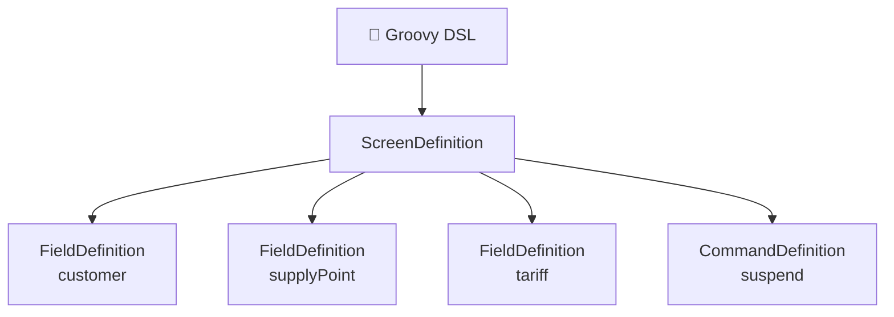

Now the DSL isn't the UI.

It defines a **UI model**.

That's a much more important distinction.

---

# 2. The UI becomes data 🧠

Imagine the resulting model:

```java
class ScreenDefinition {

    String name;

    List<FieldDefinition> fields;

    List<CommandDefinition> commands;
}
```

and:

```java
class FieldDefinition {

    String name;
    String label;
    String binding;
    FieldType type;
}
```

and:

```java
class CommandDefinition {

    String name;
    String label;

    Guard guard;
    Action action;
    String targetState;
}
```

We now have:

```text
                 UI MODEL
                    │
        ┌───────────┼───────────┐
        ▼           ▼           ▼
      fields     commands     layout
        │           │           │
        ▼           ▼           ▼
      binding     guards      panels
```

This is the point where **model-driven UI** begins.

---

# 3. The renderer becomes generic 🏭

Before:

```text
ContractScreen.java
MeterScreen.java
OutageScreen.java
CustomerScreen.java
```

After:

```text
ScreenDefinition
       │
       ▼
GenericRenderer
       │
       ├── FieldRenderer
       ├── CommandRenderer
       ├── TableRenderer
       └── LayoutRenderer
```

In Java:

```java
JPanel render(ScreenDefinition screen) {

    JPanel panel = new JPanel();

    for (FieldDefinition field : screen.fields) {
        panel.add(renderField(field));
    }

    for (CommandDefinition command : screen.commands) {
        panel.add(renderCommand(command));
    }

    return panel;
}
```

That's almost offensively simple.

And that's exactly what we want.

---

# 4. A little factory goes a long way 🏗️

The renderer could contain:

```java
JComponent renderField(FieldDefinition field) {

    switch (field.type) {

        case TEXT:
            return new JTextField();

        case DATE:
            return new DateField();

        case NUMBER:
            return new NumericField();

        case CHOICE:
            return new JComboBox();

        case TABLE:
            return new JTable();

        default:
            throw new UnsupportedOperationException();
    }
}
```

Suddenly one renderer can create:

```text
Customer UI
Contract UI
Meter UI
Tariff UI
Outage UI
Work Order UI
```

from metadata.

The application becomes:

```text
domain semantics
      +
presentation metadata
      =
runtime UI
```

---

# 5. Energy & Utilities is almost begging for this ⚡

Imagine a `SupplyPoint` definition:

```groovy
entity "SupplyPoint" {

    field "code" {
        type "text"
        label "Supply Point"
        required true
    }

    field "voltageLevel" {
        type "choice"
        values ["LV", "MV", "HV"]
    }

    field "location" {
        type "text"
        label "Location"
    }

    field "meter" {
        type "reference"
        entity "Meter"
    }
}
```

The renderer can construct the UI.

But notice something subtle.

We're no longer really describing Swing.

We're describing **domain-oriented presentation metadata**.

---

# 6. Domain model versus UI model ⚡

This distinction becomes critical.

Don't do this:

```text
Domain Model
     │
     └── annotations everywhere
            │
            └── generate entire UI
```

For example, this looks attractive:

```java
class SupplyContract {

    @Label("Customer")
    @Required
    Customer customer;

    @Label("Tariff")
    Tariff tariff;
}
```

But eventually you get:

```text
@Label(...)
@Required
@Editable(...)
@VisibleWhen(...)
@Permission(...)
@Layout(...)
@Column(...)
@Widget(...)
@Format(...)
@Sort(...)
@Filter(...)
@Workflow(...)
```

😱

Your domain model becomes a UI metadata dumpster.

---

# 7. Keep the models separate 🧱

I'd prefer:

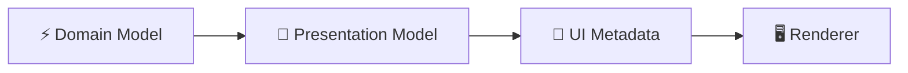

The domain says:

```text
SupplyContract
 ├── customer
 ├── supplyPoint
 ├── tariff
 └── status
```

The presentation model says:

```text
SupplyContractPM
 ├── customerName
 ├── supplyPointCode
 ├── tariffName
 ├── status
 ├── canSuspend
 └── suspend()
```

And metadata says:

```text
customerName
 ├── label = Customer
 ├── type = text
 └── editable = false
```

Three different concerns.

Three different models.

That separation is worth protecting.

---

# 8. Data binding enters the picture 🔄

Now we hit another classic Swing problem:

> Keeping the model and UI synchronized.

Without binding:

```text
Domain
   │
   ▼
Controller
   │
   ▼
JTextField.setText()
   │
   ▼
JLabel.setText()
   │
   ▼
JTable.updateUI()
```

And then:

> "Why didn't that field update?" 🤬

A model-driven architecture wants:

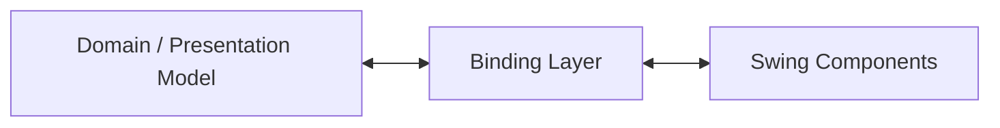

So:

```text
model.customerName
       ⇅
JTextField.text
```

and:

```text
model.status
       ⇅
JLabel.text
```

The UI becomes a projection of the presentation model.

---

# 9. Binding is more powerful than generation 🔄

Generating:

```java
new JTextField()
new JLabel()
new JButton()
```

isn't particularly interesting.

That's just code generation.

The harder problem is:

```text
How does state flow?
```

For example:

```text
User edits tariff
       │
       ▼
Presentation Model
       │
       ▼
validation
       │
       ▼
domain/application service
       │
       ▼
new state
       │
       ▼
presentation model
       │
       ▼
Swing
```

That's where a model-driven architecture earns its keep.

---

# 10. Reactive thinking — before "reactive UI" became fashionable 🤓

You could think of the UI as a function:

```text
UI = f(PresentationModel)
```

When the model changes:

```text
PM₁ → PM₂
```

the UI should become:

```text
UI₁ → UI₂
```

Conceptually:

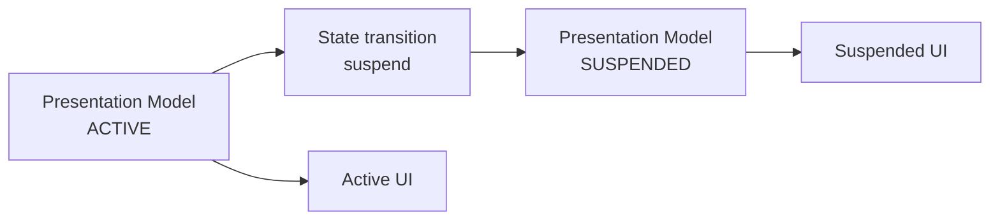

This is getting surprisingly close to ideas that later became mainstream in:

```text
React
Elm
Redux
MobX
Rx
Vue
functional reactive programming
```

The vocabulary changed.

The underlying problem didn't.

---

# 11. The workflow model + presentation model 🔀

Now combine Parts I and II.

We have:

```text
Domain
  │
  ├───────────────┐
  ▼               ▼
Presentation     Workflow
Model            Model
  │               │
  └───────┬───────┘
          ▼
       UI Model
          │
          ▼
       Renderer
```

Or:

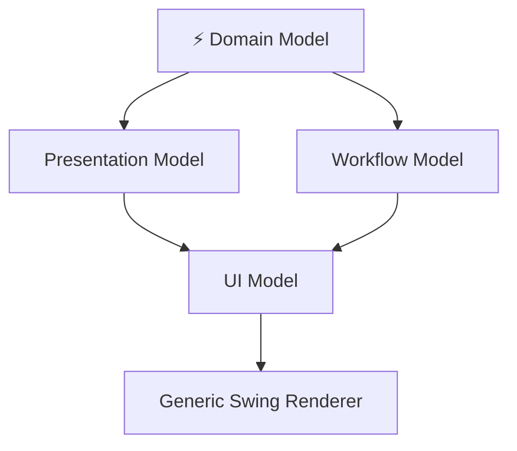

Now we're talking.

The UI isn't generated from a database schema.

It's generated from **application semantics**.

That's a huge difference.

---

# 12. Database-driven UI vs model-driven UI 🆚

These two approaches are often confused.

### Database-driven

```text
TABLE
 │
 ▼
Columns
 │
 ▼
Forms
```

You might get:

```text
CUSTOMER
──────────────
ID
NAME
ADDRESS
PHONE
```

and automatically generate:

```text
Customer Form
```

Useful?

Absolutely.

But it knows almost nothing about the business.

---

### Model-driven

```text
DOMAIN
  │
  ▼
SEMANTIC MODEL
  │
  ├── state
  ├── commands
  ├── constraints
  ├── relationships
  ├── permissions
  └── workflow
       │
       ▼
      UI
```

This can produce something meaningful:

```text
Supply Contract
────────────────────────

Customer:      ACME
Supply Point:  IT001...
Tariff:        Industrial T2
Status:        ACTIVE

[ Suspend ] [ Measurements ]
[ Change Tariff ]
```

The UI understands what a contract **is**.

Not merely what columns it has.

---

# 13. Metadata can describe layout too 📐

We can extend the DSL:

```groovy
screen "SupplyContract" {

    layout "form"

    section "Identity" {

        field "customerName"

        field "supplyPointCode"
    }

    section "Commercial" {

        field "tariffName"

        field "startDate"
        field "endDate"
    }

    section "Operations" {

        command "suspend"
        command "terminate"
    }
}
```

The renderer can transform this into:

```text
┌─────────────────────────────────────────────┐
│ Supply Contract                             │
├─────────────────────────────────────────────┤
│ Identity                                    │
│                                             │
│ Customer       [ ACME Industries         ]  │
│ Supply Point   [ IT001E12345678          ]  │
│                                             │
│ Commercial                                  │
│                                             │
│ Tariff         [ Industrial T2            ] │
│ Start          [ 2026-01-01               ] │
│ End            [ 2026-12-31               ] │
│                                             │
│ Operations                                  │
│                                             │
│ [ Suspend ] [ Terminate ]                   │
└─────────────────────────────────────────────┘
```

No screen-specific Java class required.

---

# 14. But don't generate everything ⚠️

This is where model-driven development can go horribly wrong.

The seductive idea is:

```text
metadata
   ↓
generate
   ↓
EVERYTHING
```

Eventually you get:

```text
GeneratedScreen9384.java
GeneratedPanel8273.java
GeneratedController9287.java
GeneratedValidator1288.java
GeneratedBinding8273.java
```

Congratulations.

You've reinvented a compiler whose target language is **bad Java**.

😬

---

# 15. Generate mechanics, not semantics

This is the rule I'd use:

> **Generate repetitive mechanics. Keep business semantics explicit.**

Good candidates:

```text
✓ field construction
✓ binding
✓ labels
✓ formatting
✓ table columns
✓ basic validation wiring
✓ command rendering
✓ menus
✓ keyboard shortcuts
✓ layout
```

Bad candidates:

```text
✗ billing algorithms
✗ tariff calculation
✗ network optimization
✗ domain invariants
✗ settlement logic
✗ outage decisions
✗ complicated business rules
```

In other words:

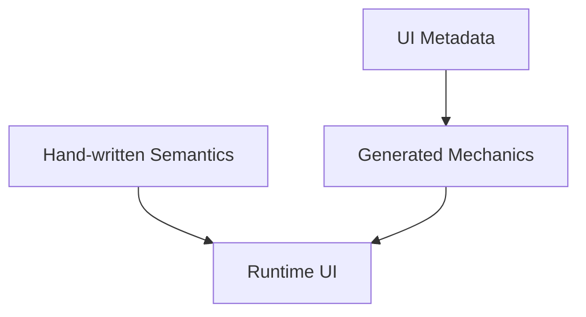

The generator should make boring things boring.

---

# 16. Partial generation 🧩

Another possibility is to generate only a skeleton.

For example:

```java
class SupplyContractScreen
        extends GeneratedSupplyContractScreen {

    @Override
    protected void configureCommands() {

        suspendButton.setAction(
            workflow.command("suspend")
        );
    }
}
```

The generated superclass handles:

```text
layout
fields
binding
basic widgets
```

while hand-written code handles:

```text
special behavior
domain-specific interaction
```

This gives us an escape hatch.

And escape hatches are important.

---

# 17. A better architecture: runtime metadata 🧠

We don't necessarily need source-code generation at all.

The DSL can produce metadata at runtime:

```text
Groovy DSL
    │
    ▼
ScreenDefinition
    │
    ▼
Generic Renderer
    │
    ▼
Swing
```

For example:

```groovy
screen "Meter" {

    field "serialNumber"
    field "status"
    field "installationDate"

    command "replace"
    command "retire"
}
```

becomes:

```text
ScreenDefinition
{
    name: "Meter"

    fields:
    [
        serialNumber,
        status,
        installationDate
    ]

    commands:
    [
        replace,
        retire
    ]
}
```

No generated Java.

No compilation step.

Just interpretation.

---

# 18. Interpreter versus generator 🥊

There are two architectures:

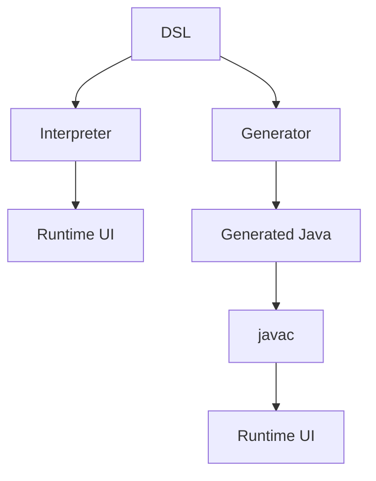

### Interpreter

```text
DSL → runtime model → UI
```

Pros:

```text
fast iteration
simple architecture
dynamic
easy experimentation
```

Cons:

```text
runtime errors
less static checking
potentially harder tooling
```

### Generator

```text
DSL → Java → compiler → UI
```

Pros:

```text
compile-time checking
potentially faster runtime
IDE integration
generated source
```

Cons:

```text
build complexity
generated-code problems
debugging
incremental generation
```

For a **2009 Groovy/Swing experiment**, I'd probably start with the interpreter.

KISS.

---

# 19. The DSL can describe the whole application 🌐

Once we have:

```text
screens
states
commands
bindings
validation
permissions
navigation
```

we can describe an entire operational application.

For example:

```groovy
application "GridOperations" {

    workflow "Outage"

    workflow "SupplyContract"

    workflow "Meter"

    screen "Customer"

    screen "SupplyPoint"

    screen "Tariff"

    navigation {

        menu "Operations" {

            item "Outages"

            item "Supply Contracts"

            item "Meters"
        }
    }
}
```

The DSL has become an **application model**.

Not just a UI DSL.

---

# 20. The meta-model 🧬

And now we can draw the meta-model itself:

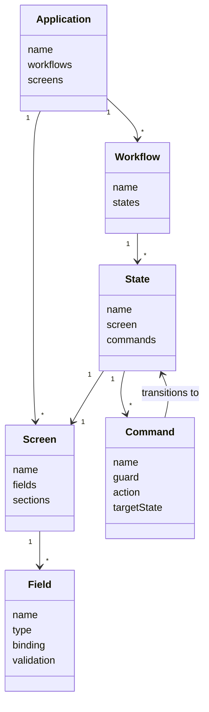

This is now a **model of the UI model**.

And that's where things get deliciously meta. 🤓

---

# 21. Model-driven UI becomes a compiler problem

At this point:

```text
Domain Model
      +
Presentation Model
      +
Workflow Model
      +
UI Metadata
      │
      ▼
 Application Model
      │
      ├──────────► Swing
      ├──────────► Web
      ├──────────► Documentation
      └──────────► Tests
```

This starts resembling a compiler pipeline:

```text
SOURCE MODEL
     │
     ▼
INTERMEDIATE MODEL
     │
     ├── optimization
     ├── validation
     └── analysis
     │
     ▼
TARGET
```

Except our target is not:

```text
x86
ARM
WASM
```

It is:

```text
Swing
Web
CLI
Mobile
Documentation
Tests
```

---

# 22. The really interesting possibility: multiple renderers 🌍

Imagine the exact same workflow:

```text
SupplyContract
 ├── Draft
 ├── Active
 ├── Suspended
 └── Terminated
```

rendered as:

### Swing

```text
[JButton Suspend]
```

### Web

```html
<button> Suspend </button>
```

### CLI

```text
[s] Suspend
```

### Documentation

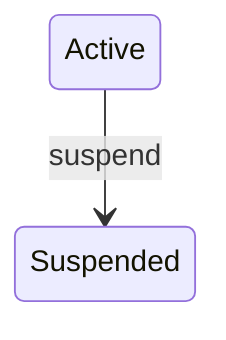

The semantic command remains:

```text
suspend
```

Only the renderer changes.

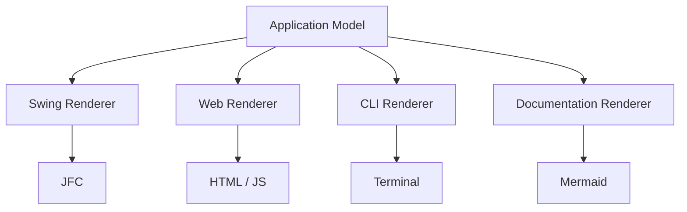

This is the real payoff.

---

# 23. What about MVC? 🤔

Someone would inevitably say:

> "Isn't this just MVC?"

Yes.

And no.

MVC already gives us:

```text
Model
View
Controller
```

But here we're making **workflow and presentation semantics explicit models**.

So instead of:

```text
MVC
```

we have something closer to:

```text
                 DOMAIN
                   │
             ┌─────┴─────┐
             ▼           ▼
       PRESENTATION   WORKFLOW
          MODEL         MODEL
             │           │
             └─────┬─────┘
                   ▼
                 VIEW
```

It's less about inventing a new architectural pattern and more about **making implicit models explicit**.

---

# 24. And this is where MDA enters the picture 🏗️

If we want to be historically geeky:

```text
Model-Driven Architecture
```

was already a significant architectural idea around this era.

The general idea:

```text
Platform Independent Model
          │
          ▼
Platform Specific Model
          │
          ▼
Implementation
```

Our little UI architecture has a similar shape:

```text
Application semantics
        ↓
Presentation Model
        ↓
Swing-specific Renderer
```

That's essentially a tiny MDA pipeline.

Not necessarily "MDA" in the formal OMG sense.

But philosophically very close.

---

# 25. Where the idea breaks 💥

Now for the important part.

A sufficiently clever DSL eventually starts accumulating:

```text
if
else
loops
expressions
variables
functions
inheritance
mixins
templates
macros
```

At which point:

```text
DSL
```

becomes:

```text
Programming Language
```

Congratulations.

You have invented another programming language.

This is a recurring DSL failure mode.

```text
simple DSL
    │
    ▼
more expressive
    │
    ▼
conditions
    │
    ▼
loops
    │
    ▼
functions
    │
    ▼
libraries
    │
    ▼
compiler
    │
    ▼
"Why aren't we just using Java?"
```

😈

Groovy helps here because it gives us an escape hatch.

---

# 26. The escape hatch 🛟

Keep the DSL small:

```groovy
screen(...)
field(...)
section(...)
command(...)
state(...)
workflow(...)
validate(...)
bind(...)
goto(...)
```

And delegate complicated logic:

```groovy
enabledWhen {
    model.canSuspend()
}
```

instead of inventing:

```text
WHEN customer.balance > 1000
AND meter.type = "A"
AND tariff.valid
AND ...
```

The host language remains the escape hatch.

So the architecture becomes:

```text
        DSL
         │
    simple semantics
         │
         ▼
      Groovy
         │
    complex logic
         │
         ▼
       Java
         │
    domain semantics
```

Three layers.

Three levels of abstraction.

---

# 27. Don't turn metadata into a religion 🙏

There is another trap.

Not everything deserves metadata.

If a screen is highly specialized:

```text
SCADA-like visualization
network topology
geographical map
complex time-series chart
```

then a generic renderer may become absurd.

For example:

```text
Map
 ├── network topology
 ├── voltage levels
 ├── animated flows
 ├── alarms
 └── geographic layers
```

Trying to describe every pixel declaratively may produce a DSL worse than the original Swing code.

So:

> **Use declarative modeling where the domain has stable structure.**

Use ordinary code where interaction is genuinely algorithmic or highly visual.

---

# 28. The 80/20 architecture 🎯

I'd therefore aim for:

```text
                 Application
                      │
          ┌───────────┴───────────┐
          │                       │
      Declarative              Imperative
          │                       │
          ▼                       ▼
    Stable mechanics        Special behavior
          │                       │
          ▼                       ▼
      DSL / Model             Java / Groovy
          │                       │
          └───────────┬───────────┘
                      ▼
                    UI
```

Maybe:

```text
80% generated/declarative
20% hand-written
```

But **not as a hard rule**.

The correct ratio depends on the domain.

The principle is:

> **Automate repetition, not thought.**

---

# 29. And now we can close the loop 🔄

Let's return to the original 2009 idea.

It started as:

> "Could we use Groovy to describe Swing workflows?"

Then:

```text
Groovy DSL
     ↓
Workflow Model
```

Then:

```text
Workflow Model
     +
Presentation Model
     ↓
UI Model
```

Then:

```text
UI Model
     ↓
Generic Renderer
```

Then:

```text
Application Model
     ├── Swing
     ├── Web
     ├── Tests
     └── Documentation
```

The evolution looks like:

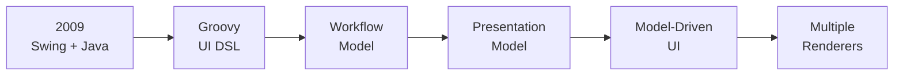

That's a pretty natural progression.

---

# 30. The final architecture ⚡

If I were drawing the whole thing on a whiteboard, I'd probably end up here:

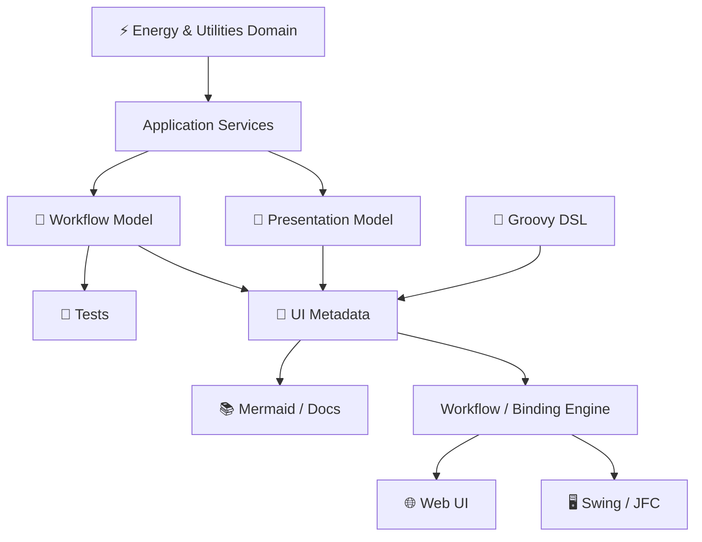

And notice something important:

**Swing has become almost incidental.**

That's actually the architectural victory.

The hard part is:

```text
domain
workflow
state
commands
presentation
binding
```

The GUI toolkit is merely one backend.

---

# 31. So… was the 2009 idea crazy? 😎

No.

But I'd phrase it more precisely today.

I wasn't really proposing:

> "Let's write Swing with Groovy."

I was implicitly proposing:

> **"Let's externalize the application's interaction model from its widget implementation."**

And that's a much stronger architectural idea.

The progression is:

```text
OO Domain
    │
    ▼
Presentation Model
    │
    ▼
Workflow Model
    │
    ▼
Declarative DSL
    │
    ▼
Model
    │
    ├──────► Swing
    ├──────► Web
    ├──────► Tests
    └──────► Documentation
```

The DSL is not the architecture.

The **model** is.

The DSL is simply a pleasant way of writing the model.

And the renderer?

```text
JFrame
JPanel
JButton
JTable
...
```

Those are just implementation details.

---

# 32. The punchline 🎯

The three-part journey therefore becomes:

```text
PART I
"When Swing Met the Grid"
        │
        ▼
Separate domain semantics
from Swing widgets.

PART II
"The Grid Is a State Machine"
        │
        ▼
Make commands, states,
guards and transitions explicit.

PART III
"From Swing DSL to Model-Driven UI"
        │
        ▼
Turn those semantics into
a reusable application model.
```

Or, in one diagram:

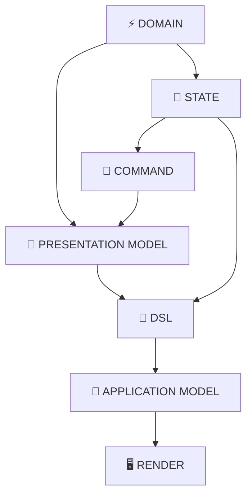

And that leaves us with the most interesting question of all:

> **If the application can be described as a model, can we make the model executable, testable, inspectable — and perhaps even generate the application itself?**

In 2009, that sounded like a Groovy/Swing experiment.

Today, we'd probably recognize pieces of it in:

```text
model-driven development
reactive UI
state machines
declarative UI
schema-driven UI
workflow engines
code generation
low-code platforms
```

Different names.

Same underlying pressure:

> **Make the semantics explicit.**

And perhaps that's the real lesson from trying to tame Swing:

**Don't make the UI smarter.  
Make the model smarter.** ⚡
