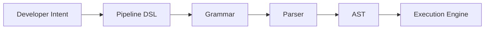

# 🧙‍♂️ The Language Awakens

## A Cosmic Software Engineering Saga — Part I

> *Before the machine could understand the program, somebody first had to decide what “understand” meant.*

There was once a programmer.

The programmer had a problem.

The problem had a specification.

The specification had requirements.

The requirements had requirements.

And the requirements had requirements about the requirements.

Eventually the programmer opened a terminal and typed:

```text
$ grep -R "requirement" .
```

Nothing happened.

The programmer sighed.

Somewhere in the history of computing, another programmer had already discovered the solution:

**Give the problem a language.**

---

# 🏛️ 1. The ALGOL Temple

The Cosmic Pipeline begins with ALGOL.

Not because ALGOL is the final word in programming languages.

Quite the opposite.

It is interesting because it represents a decisive conceptual movement:

```text
unstructured instructions
          ↓
structured programs
          ↓
structured thought
```

The original saga describes ALGOL as the “elder sage” whose block structure establishes the structural foundation for everything that follows.

Consider:

```text
BEGIN

    statement;

    IF condition THEN
    BEGIN
        statement;
        statement;
    END;

END
```

The braces, keywords and indentation are not merely decoration.

They establish boundaries.

And boundaries are one of the oldest tricks in software engineering.

---

# 🧱 2. Structure Is an Engineering Tool

A system without boundaries becomes a soup.

```text
GLOBAL EVERYTHING
      |
      +-- stuff
      +-- more stuff
      +-- mysterious stuff
      +-- code written in 2017
      +-- code nobody wants to touch
```

A structured system instead says:

```text
MODULE
 ├── INPUT
 ├── PROCESS
 └── OUTPUT
```

This idea survives everywhere:

* functions
* modules
* packages
* namespaces
* classes
* services
* components
* containers
* processes

The syntax changes.

The principle doesn't.

> **Give complexity a boundary.**

---

# 🧪 3. A Tiny DSL

Suppose we're building a data-processing pipeline.

Instead of writing implementation details:

```python
import json

data = load_data()

for item in data:
    parsed = json.loads(item)
    result = transform(parsed)
    store(result)
```

we invent:

```text
pipeline {
    input json
    parse
    transform
    output
}
```

This is a DSL.

The language expresses the **domain**, not the machinery.



And now the architecture has become visible.

---

# 📜 4. BNF — The Constitution

Our DSL needs rules.

```bnf
<program> ::= <pipeline>

<pipeline> ::= "pipeline" "{"
                 <statement>*
               "}"

<statement> ::= <input>
              | <parse>
              | <transform>
              | <output>

<input> ::= "input" <identifier>
<parse> ::= "parse"
<transform> ::= "transform"
<output> ::= "output"
```

BNF gives us something wonderfully bureaucratic:

**permission.**

It answers:

> Is this program legal?

The machine no longer needs to guess.

---

# 🐍 5. Python: The Tiny Parser

We can implement a deliberately tiny parser.

```python
TOKENS = [
    "pipeline",
    "{",
    "input",
    "json",
    "parse",
    "transform",
    "output",
    "}"
]

def parse(tokens):
    assert tokens.pop(0) == "pipeline"
    assert tokens.pop(0) == "{"

    statements = []

    while tokens[0] != "}":
        keyword = tokens.pop(0)

        if keyword == "input":
            value = tokens.pop(0)
            statements.append(("input", value))

        elif keyword in {"parse", "transform", "output"}:
            statements.append((keyword,))

        else:
            raise SyntaxError(keyword)

    tokens.pop(0)

    return {
        "type": "pipeline",
        "statements": statements
    }


print(parse(TOKENS.copy()))
```

Result:

```text
{
  'type': 'pipeline',
  'statements': [
      ('input', 'json'),
      ('parse',),
      ('transform',),
      ('output',)
  ]
}
```

We have crossed an important boundary.

The program was text.

Now it is data.

---

# 🌳 6. JavaScript Joins the Expedition

JavaScript can do exactly the same thing.

```javascript
function parsePipeline(tokens) {
    let i = 0;

    if (tokens[i++] !== "pipeline")
        throw new SyntaxError("expected pipeline");

    if (tokens[i++] !== "{")
        throw new SyntaxError("expected {");

    const statements = [];

    while (tokens[i] !== "}") {
        const keyword = tokens[i++];

        switch (keyword) {
            case "input":
                statements.push({
                    type: "input",
                    value: tokens[i++]
                });
                break;

            case "parse":
            case "transform":
            case "output":
                statements.push({
                    type: keyword
                });
                break;

            default:
                throw new SyntaxError(keyword);
        }
    }

    return {
        type: "pipeline",
        statements
    };
}
```

JavaScript is not doing anything fundamentally different.

The language changed.

The abstraction did not.

---

# ⚙️ 7. C++: The Machine Wants Types

Now our C++ implementation can make the model explicit.

```cpp
#include <string>
#include <vector>
#include <variant>

struct Input {
    std::string format;
};

struct Parse {};
struct Transform {};
struct Output {};

using Statement =
    std::variant<Input, Parse, Transform, Output>;

struct Pipeline {
    std::vector<Statement> statements;
};
```

This is interesting because the AST is now encoded in the type system.

The program is no longer:

```text
some strings
```

It becomes:

```text
Pipeline
 └── Statement[]
       ├── Input
       ├── Parse
       ├── Transform
       └── Output
```

The programmer has constructed a tiny semantic universe.

---

# 🌲 8. Enter the AST

The original Cosmic Pipeline calls syntax trees the “Forest of Logic.”

That metaphor is surprisingly accurate.

```text
                    PIPELINE
                       |
          +------------+------------+
          |            |            |
        INPUT         PARSE       OUTPUT
          |
         JSON
```

A tree provides something text cannot:

**relationships.**

We can ask:

* What is this node?
* Who is its parent?
* Which operation follows it?
* Which expression controls it?
* Can this branch be optimized?

And now we are no longer merely parsing.

We are engineering a representation.

---

# 🤯 9. The First Great Abstraction

This is the first major lesson of the saga:

```text
TEXT
 ↓
STRUCTURE
 ↓
MODEL
```

Once the program becomes a model, we can:

```text
analyze
validate
transform
optimize
generate
execute
```

This is why ASTs are so important.

They create a stable point between language and execution.

---

# 🔄 10. DSLs Everywhere

The same pattern appears in:

```text
SQL
  ↓
query tree

Regex
  ↓
automaton / syntax tree

HTML
  ↓
DOM

CSS
  ↓
rule tree

Terraform
  ↓
resource model

Kubernetes YAML
  ↓
object graph

Build systems
  ↓
dependency graph
```

A DSL is therefore not simply “a funny little language.”

It is a way of exposing a domain's **native vocabulary**.

---

# 👽 11. The Programmer Meets the Parser

At 03:17 AM the programmer asks:

> “Why can't the parser understand what I meant?”

The parser replies:

> “Because you didn't specify it.”

The programmer:

> “But it's obvious.”

The parser:

> “To whom?”

Silence.

This is the eternal conflict between human intuition and formal systems.

Humans infer.

Machines require rules.

Software engineering exists somewhere in the middle.

---

# 🧠 12. The First Law

The machine eventually writes the following message onto the terminal:

```text
╔══════════════════════════════════════╗
║ FIRST LAW OF THE PIPELINE            ║
║                                      ║
║ Make structure explicit.             ║
║                                      ║
║ Explicit structure can be analyzed.  ║
╚══════════════════════════════════════╝
```

And once structure can be analyzed...

It can be transformed.

The trees are waiting.

---

## 🚀 Next: Part II

**The Forest of Trees**

ASTs will discover IR.

IR will discover optimization.

Optimization will discover that the same computation can have several representations.

And eventually the compiler will ask:

> “What if we changed the shape of the problem?”

Which is where things get dangerous.
