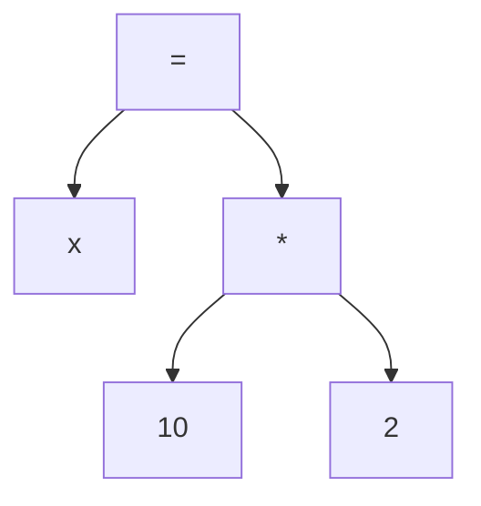
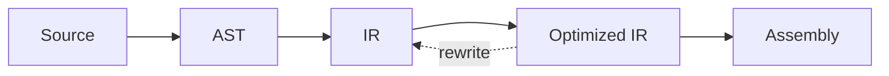
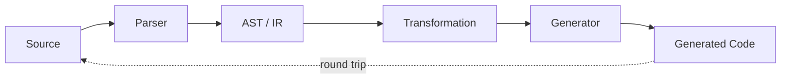
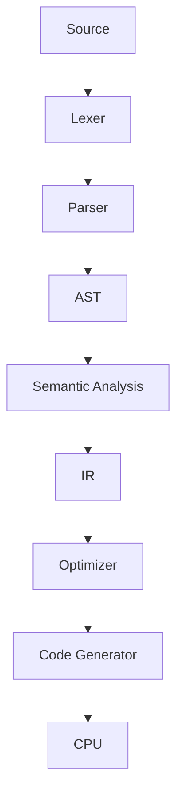

# 🌲 The Forest of Trees

## A Cosmic Software Engineering Saga — Part II

> *The parser had created a tree.*
>
> *The compiler looked at it.*
>
> *The compiler smiled.*
>
> *The tree became nervous.*

---

# 🌳 1. Everything Is a Tree Until Proven Otherwise

The programmer begins with:

```python
x = 10 * 2
```

A human sees:

> “Obviously, x becomes twenty.”

The compiler sees:

```text
ASSIGN
├── x
└── MULTIPLY
    ├── 10
    └── 2
```

The compiler has an advantage.

It doesn't need to understand English.

It needs only to understand relationships.



Now the machine can reason about the structure.

---

# 🧠 2. AST Is Not the End

An AST is convenient for understanding source code.

But machine execution has other concerns.

For example:

```text
AST
 ↓
semantic analysis
 ↓
IR
 ↓
optimization
 ↓
machine code
```

The intermediate representation is where the compiler begins stripping away accidental details.



The source language might be Python, C++, Rust or some DSL.

The IR is concerned with operations.

---

# 🔧 3. A Tiny Transformation

Input:

```text
x = 10 * 2
```

Optimization:

```text
10 * 2 → 20
```

Output:

```text
x = 20
```

This is constant folding.

In Python, we can play with the idea ourselves.

```python
def constant_fold(node):
    if (
        isinstance(node, tuple)
        and node[0] == "*"
        and isinstance(node[1], int)
        and isinstance(node[2], int)
    ):
        return node[1] * node[2]

    return node


tree = ("*", 10, 2)

print(constant_fold(tree))
```

Output:

```text
20
```

Tiny.

But conceptually huge.

We transformed a representation into another representation with the same meaning.

---

# 🪄 4. JavaScript AST Transformation

The same concept in JavaScript:

```javascript
function constantFold(node) {
    if (
        node.type === "BinaryExpression" &&
        node.operator === "*" &&
        node.left.type === "Literal" &&
        node.right.type === "Literal"
    ) {
        return {
            type: "Literal",
            value: node.left.value * node.right.value
        };
    }

    return node;
}
```

The tree is now programmable.

We can write transformations over syntax.

This is the foundation of:

* compilers
* transpilers
* linters
* formatters
* codemods
* static analyzers
* source generators

---

# 🧱 5. C++ and Typed IR

A tiny C++ IR might look like:

```cpp
struct Constant {
    int value;
};

struct Add {
    int lhs;
    int rhs;
};

struct Mul {
    int lhs;
    int rhs;
};
```

Or, more realistically, we use node IDs:

```cpp
using NodeId = std::size_t;

struct Instruction {
    enum Kind {
        Constant,
        Add,
        Multiply
    };

    Kind kind;
    NodeId lhs{};
    NodeId rhs{};
    int value{};
};
```

Now the compiler has its own little machine language.

Not CPU machine code.

A **machine for reasoning about machines**.

---

# 🔄 6. Round-Trip Engineering

The architecture can be reversed:



This pattern appears in:

```text
source → AST → source
SQL → query model → SQL
JSON → object → JSON
schema → model → generated code
UI → component tree → generated UI
```

The important thing is the middle.

The model.

---

# 🧬 7. Representation Engineering

Consider a database query:

```sql
SELECT name
FROM users
WHERE age > 40;
```

A database does not simply throw the string at the disk.

Conceptually:

```text
SQL
 ↓
PARSE
 ↓
QUERY TREE
 ↓
QUERY PLAN
 ↓
OPTIMIZATION
 ↓
EXECUTION
```

The query plan might decide:

```text
full table scan
```

or:

```text
use age index
```

The meaning is unchanged.

The representation of the computation has changed.

That is **representation engineering**.

---

# 🧠 8. The Same Idea Appears Everywhere

```text
Source Code
     ↓
AST
     ↓
IR
```

is structurally similar to:

```text
SQL
     ↓
Query Tree
     ↓
Query Plan
```

and:

```text
Raw Data
     ↓
Features
     ↓
Vectors
```

and:

```text
Audio
     ↓
Spectrum
     ↓
Features
```

and:

```text
Image
     ↓
Tensor
     ↓
GPU Kernel
```

The engineering move is always similar:

> **Find a representation that makes the next operation cheap or possible.**

---

# 🧪 9. A Python Mini Optimizer

Let's build something tiny.

```python
def optimize(expr):
    if isinstance(expr, int):
        return expr

    op, left, right = expr

    left = optimize(left)
    right = optimize(right)

    if isinstance(left, int) and isinstance(right, int):
        if op == "+":
            return left + right
        if op == "*":
            return left * right

    return (op, left, right)


program = (
    "*",
    ("+", 10, 20),
    2
)

print(optimize(program))
```

Result:

```text
60
```

The optimizer has reduced:

```text
(10 + 20) * 2
```

to:

```text
60
```

---

# 🧑‍🔬 10. Optimization Is Controlled Violence

Optimization is basically taking a perfectly respectable representation and saying:

> “You are unnecessarily complicated.”

Then replacing it.

The original survives semantically.

Its implementation does not.

```text
BEFORE
   ↓
  🌳🌳🌳
   ↓
TRANSFORMATION
   ↓
  🌱
   ↓
AFTER
```

The compiler is therefore a kind of semantic surgeon.

It removes structure without removing meaning.

---

# 🧩 11. The Compiler as a Pipeline

Now the original Cosmic Pipeline begins looking familiar.



Every arrow is a transformation boundary.

Every representation solves a different problem.

---

# 🤖 12. The AI Connection

Modern AI-assisted coding tools add another interesting layer.

A model can transform:

```text
natural language
 ↓
code
```

or:

```text
code
 ↓
explanation
```

or:

```text
old code
 ↓
new structure
```

Conceptually:

```text
INTENT
 ↓
REPRESENTATION
 ↓
TRANSFORMATION
 ↓
NEW REPRESENTATION
```

The machinery is different.

The pattern is ancient.

---

# 👻 13. The Ghost of Refactoring

The programmer says:

> “I will refactor this.”

The code says:

> “You said that last year.”

The programmer says:

> “This time I'll write tests.”

The code says:

> “You said that too.”

Eventually:

```text
tests
 ↓
AST
 ↓
transformation
 ↓
tests
```

becomes a disciplined way to restructure software while preserving behavior.

---

# ⚖️ 14. Semantic Preservation

This is the key constraint:

```text
BEFORE
   │
   │ transform
   ▼
AFTER

meaning(BEFORE) == meaning(AFTER)
```

That one equation is hiding behind an enormous amount of software engineering.

Compiler optimization.

Refactoring.

Query optimization.

Serialization.

Code generation.

Migration.

The shape can change.

The semantics must survive.

---

# 🌌 15. The Second Law

The machine writes another message:

```text
╔══════════════════════════════════════╗
║ SECOND LAW OF THE PIPELINE           ║
║                                      ║
║ Choose representations deliberately. ║
║                                      ║
║ Representation determines what      ║
║ transformations are easy.            ║
╚══════════════════════════════════════╝
```

And then the machine discovers something terrifying.

The representation can be optimized not only for algorithms.

It can be optimized for **hardware**.

The trees are about to become vectors.

---

## 🚀 Next: Part III

**The Knights of the Vector Realm**

SSE.

AVX.

NEON.

CPU capability detection.

Cache locality.

SIMD parsing.

LZ77.

Hashing.

Match finding.

The CPU is about to stop processing one thing at a time.
