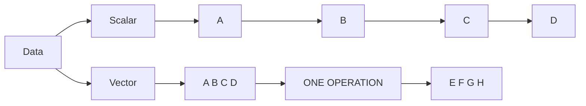
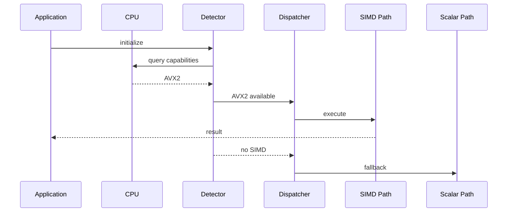
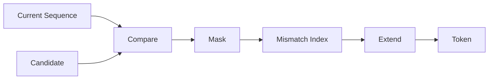

# ⚔️ The Knights of the Vector Realm

## A Cosmic Software Engineering Saga — Part III

> *The compiler had optimized the representation.*
>
> *The CPU was still unimpressed.*
>
> *“You changed the tree,” it said.*
>
> *“But did you change the memory?”*

---

# 🏰 1. The CPU Has Opinions

Programmers often imagine the CPU as an obedient servant.

This is inaccurate.

The CPU has:

* caches
* pipelines
* branch predictors
* registers
* vector units
* memory hierarchies
* instruction decoders
* opinions about locality

You can write:

```cpp
for (auto x : data)
    result += x;
```

and the CPU may respond:

> “Fine.”

Or:

> “I could have done sixteen of those.”

The difference is **data-level parallelism**.

---

# ⚔️ 2. SIMD

SIMD means:

```text
Single Instruction
Multiple Data
```

Scalar:

```text
A → operation
B → operation
C → operation
D → operation
```

Vector:

```text
[A B C D]
    ↓
 operation
    ↓
[E F G H]
```

The original saga presents SSE, AVX and NEON as the “knights” of the vector realm.



---

# 🧪 3. Python: The Scalar Version

Python is not normally where we demonstrate raw SIMD.

But it is excellent for demonstrating the algorithm.

```python
data = [1, 2, 3, 4, 5, 6]

result = []

for x in data:
    result.append(x * 2)

print(result)
```

Conceptually:

```text
1 2 3 4 5 6
↓ ↓ ↓ ↓ ↓ ↓
× × × × × ×
↓ ↓ ↓ ↓ ↓ ↓
2 4 6 8 10 12
```

The algorithm has parallel structure even if the Python loop isn't directly executing as a SIMD instruction.

---

# ⚡ 4. C++: Vector-Friendly Thinking

C++ makes it easier to get closer to the machine.

A conceptual vector operation:

```cpp
#include <immintrin.h>

__m256i values =
    _mm256_setr_epi32(1, 2, 3, 4, 5, 6, 7, 8);

__m256i factor =
    _mm256_set1_epi32(2);

__m256i result =
    _mm256_mullo_epi32(values, factor);
```

One instruction operates over several integer lanes.

This is where software engineering meets architecture.

---

# 🟨 5. JavaScript: The Browser Joins

JavaScript also exposes typed arrays:

```javascript
const data = new Int32Array([1, 2, 3, 4]);

for (let i = 0; i < data.length; i++) {
    data[i] *= 2;
}
```

Modern JavaScript engines may optimize this aggressively.

But the key software-engineering principle is independent of the engine:

```text
dense data
   ↓
predictable layout
   ↓
cheap iteration
   ↓
optimization opportunity
```

---

# 🧬 6. Data Layout Is Part of the Algorithm

Consider:

```text
Person {
    age
    salary
    height
}
```

stored repeatedly:

```text
[A S H][A S H][A S H][A S H]
```

Now suppose we only need salaries.

The CPU encounters unrelated fields between useful values.

Instead:

```text
AGES
[A A A A]

SALARIES
[S S S S]

HEIGHTS
[H H H H]
```

Now salary operations become naturally vectorizable.

This is:

**Structure of Arrays (SoA).**

---

# 📦 7. Python Data-Oriented Example

```python
ages = [21, 34, 42, 51]
salaries = [30, 50, 70, 90]
heights = [170, 180, 175, 182]

for i, salary in enumerate(salaries):
    if salary > 60:
        print(ages[i], salary)
```

The important point isn't that Python magically became SIMD.

The point is that the **data representation exposes the operation**.

---

# 🧠 8. Capability Detection

But which vector instructions can we use?

The original pipeline introduces CPU detection before selecting its SIMD implementation.

Conceptually:



The general pattern:

```text
DISCOVER
   ↓
SELECT
   ↓
SPECIALIZE
   ↓
EXECUTE
```

---

# 🐍 9. Python Capability Dispatch

We can simulate the architecture:

```python
def scalar(data):
    return [x * 2 for x in data]


def optimized(data):
    # Placeholder for a native/vectorized implementation.
    return [x * 2 for x in data]


def process(data, capabilities):
    if "vector" in capabilities:
        return optimized(data)

    return scalar(data)


print(process([1, 2, 3], {"vector"}))
```

The implementation is trivial.

The architecture is not.

---

# 🔍 10. JavaScript Feature Detection

The same principle appears in browser programming:

```javascript
function chooseImplementation() {
    if (typeof WebAssembly !== "undefined") {
        return wasmImplementation;
    }

    return javascriptImplementation;
}
```

The same pattern appears in:

* WebAssembly
* GPU APIs
* browser features
* hardware acceleration
* API versions

Capability detection is therefore a general adaptive-architecture pattern.

---

# 🌊 11. SIMDJSON

Now the knights meet a real problem:

**JSON parsing.**

The original article models the pipeline as:

```text
DETECT → SPLIT → SIMD PARSE → MERGE
```

The conceptual trick is fascinating.

Instead of interpreting every character sequentially, first identify structural characters efficiently.

```text
{ } [ ] , :
```

Then use that structural information to guide parsing.


---

# 🔥 12. LZ77 Enters the Forge

Parsing wasn't enough.

The pipeline wanted to make data smaller.

Enter LZ77.

```text
HASH
 ↓
MATCH
 ↓
TOKEN
```

Suppose:

```text
ABCABCABCABC
```

Instead of repeating the same sequence:

```text
ABC ABC ABC ABC
```

the compressor can encode references to earlier occurrences.

The machine asks:

> “Have I seen this before?”

This question is deceptively powerful.

---

# 🐍 13. Tiny Python Match Finder

```python
def find_match(data, pos, window=16):
    start = max(0, pos - window)

    best_length = 0
    best_distance = 0

    for candidate in range(start, pos):
        length = 0

        while (
            pos + length < len(data)
            and data[candidate + length] == data[pos + length]
        ):
            length += 1

            if candidate + length >= pos:
                break

        if length > best_length:
            best_length = length
            best_distance = pos - candidate

    return best_distance, best_length
```

This is deliberately simple.

Real compressors spend enormous effort making this operation faster.

Because the match finder can dominate the workload.

---

# 🔮 14. The Match-Finder Oracle

The original saga summarizes the operation as:

```text
COMPARE
 ↓
MASK
 ↓
INDEX
 ↓
LENGTH++
```

That is algorithm engineering.

We identify the expensive operation.

Then we reshape it.

Then we attack it with the hardware.



---

# ⚙️ 15. C++: A Tiny Byte Matcher

```cpp
#include <cstddef>
#include <string_view>

std::size_t match_length(
    std::string_view a,
    std::string_view b)
{
    std::size_t n = 0;

    while (n < a.size() &&
           n < b.size() &&
           a[n] == b[n])
    {
        ++n;
    }

    return n;
}
```

It looks boring.

That's the point.

High-performance software often starts with an extremely boring inner loop.

Then somebody profiles it.

Then somebody says:

> “This loop runs 4 billion times.”

Then the coffee machine becomes nervous.

---

# 🧮 16. From Algorithm to Hardware

We now have:

```text
Algorithm
   ↓
expensive operation
   ↓
data representation
   ↓
SIMD
   ↓
cache locality
   ↓
CPU specialization
```

That is performance engineering.

Not:

> “Use C++ because C++ is fast.”

Rather:

> **Understand what the machine is repeatedly being asked to do.**

---

# 🤯 17. Compression and Caching

Here is the strange connection.

LZ77 asks:

```text
Have I seen this sequence before?
```

A cache asks:

```text
Have I computed this result before?
```

Memoization asks:

```text
Have I solved this input before?
```

Deduplication asks:

```text
Have I stored this content before?
```

A similarity system asks:

```text
Have I seen something sufficiently similar?
```

Different implementations.

Same philosophical move:

```text
PAST
 ↓
IDENTIFY REUSE
 ↓
AVOID DUPLICATION
```

---

# 🧠 18. The Third Law

The machine writes:

```text
╔══════════════════════════════════════╗
║ THIRD LAW OF THE PIPELINE            ║
║                                      ║
║ Performance begins with structure.   ║
║                                      ║
║ Know the data.                       ║
║ Know the algorithm.                  ║
║ Know the machine.                   ║
╚══════════════════════════════════════╝
```

And then comes the inevitable question:

> “What if one core isn't enough?”

The CPU looks at the programmer.

The programmer looks at the CPU.

The CPU activates core #2.

---

## 🚀 Next: Part IV

**The Council of Cores**

Threads.

Tasks.

Queues.

Pipelines.

Backpressure.

MapReduce.

Workers.

Clusters.

The ancient pattern of:

```text
SPLIT
→
PROCESS
→
MERGE
```

is about to escape the CPU.
