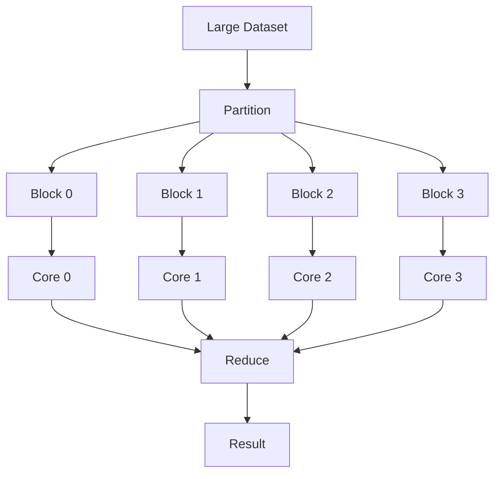
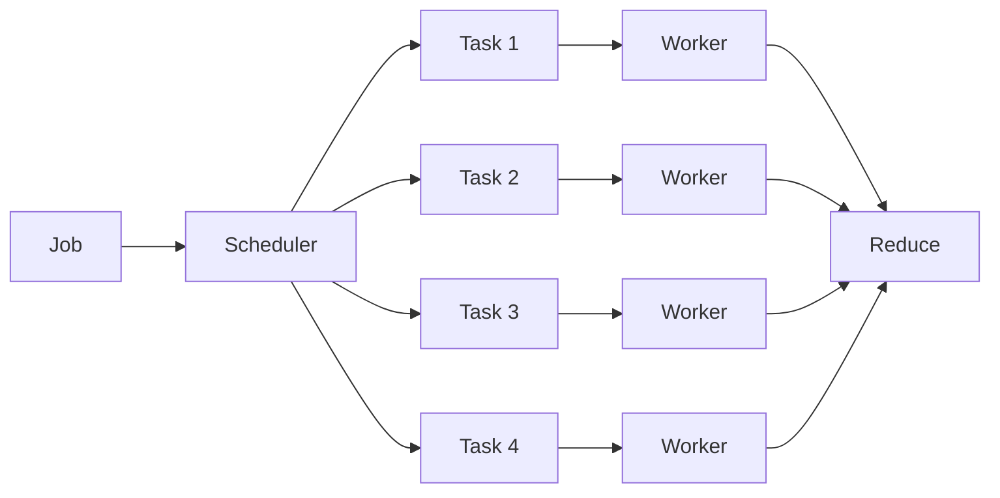
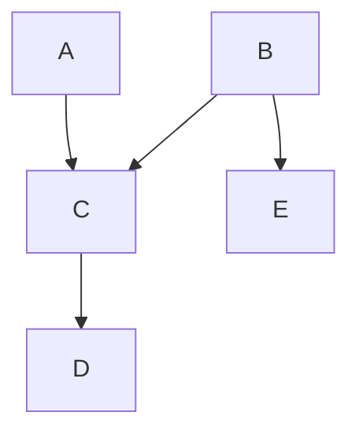
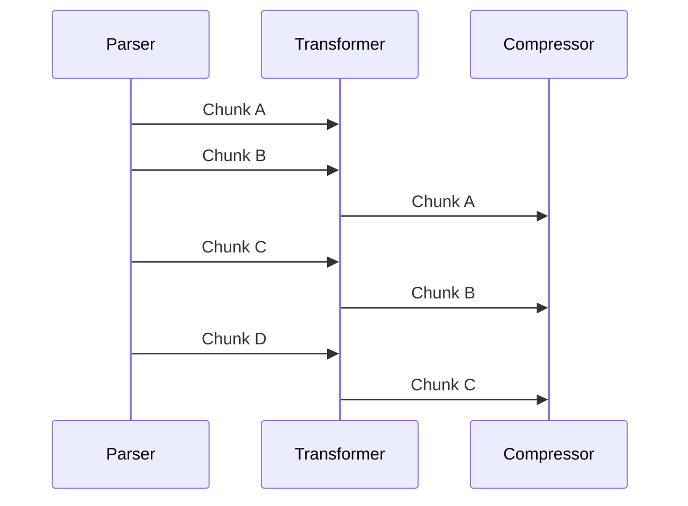
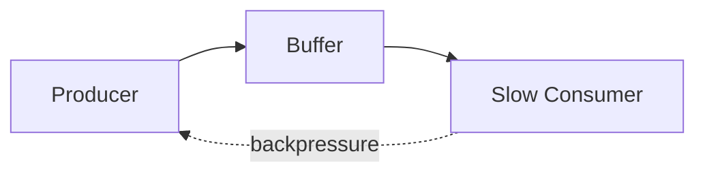
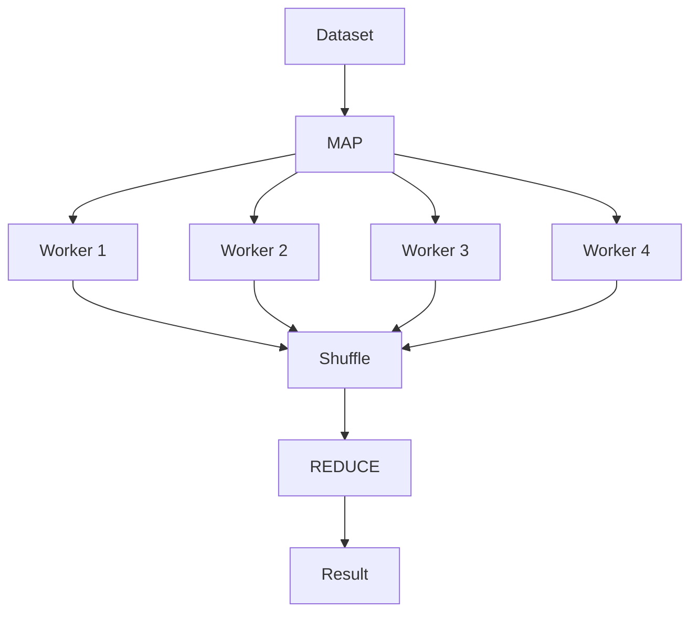
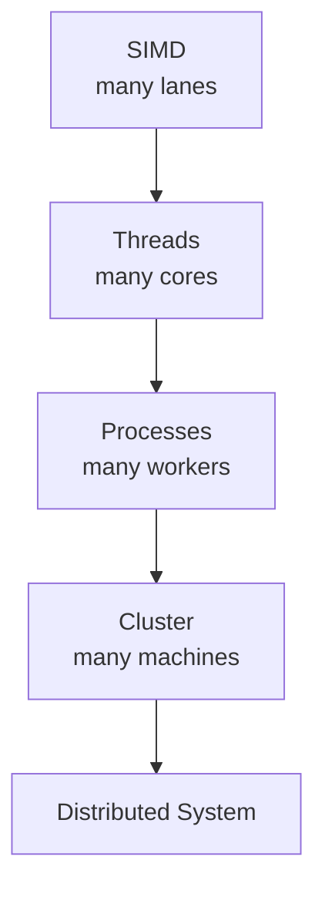
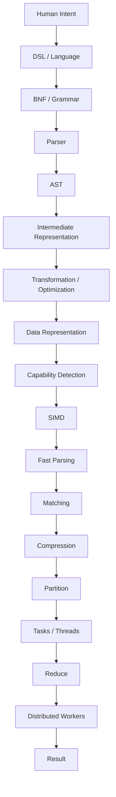

# 🧵 The Council of Cores

## A Cosmic Software Engineering Saga — Part IV

> *One core was working.*
>
> *Two cores were waiting.*
>
> *Thirty-two cores were having a meeting.*
>
> *The scheduler had entered the building.*

---

# 🏛️ 1. The Problem of Sequence

A sequential program says:

```text
A
↓
B
↓
C
↓
D
```

Everything waits for everything else.

This is beautifully simple.

It is also occasionally ridiculous.

If A and B are independent:

```text
A ───────────────┐
                 ├──→ C
B ───────────────┘
```

why should B wait for A?

This is the conceptual beginning of parallelism.

---

# 🧩 2. Partition the Work

The original saga describes independent blocks being assigned to independent cores.

```text
INPUT
 │
 ├── BLOCK 0
 ├── BLOCK 1
 ├── BLOCK 2
 └── BLOCK 3
```

Then:



The pattern is ancient:

```text
PARTITION
   ↓
PROCESS
   ↓
RECOMBINE
```

---

# 🐍 3. Python: Threading the Idea

Python gives us a useful demonstration, even though CPU-bound execution has runtime-specific constraints.

```python
from concurrent.futures import ThreadPoolExecutor

def process(block):
    return sum(x * x for x in block)


blocks = [
    [1, 2, 3],
    [4, 5, 6],
    [7, 8, 9],
    [10, 11, 12],
]

with ThreadPoolExecutor(max_workers=4) as pool:
    results = list(pool.map(process, blocks))

print(results)
print(sum(results))
```

The important architecture is:

```text
blocks
 ↓
workers
 ↓
results
 ↓
reduce
```

The particular runtime implementation is secondary.

---

# ⚡ 4. Python: Process Parallelism

For CPU-heavy independent work, processes are another option:

```python
from concurrent.futures import ProcessPoolExecutor

def square_sum(values):
    return sum(x * x for x in values)

with ProcessPoolExecutor() as pool:
    results = pool.map(square_sum, blocks)

print(sum(results))
```

Now the operating system can schedule work across separate processes.

The abstraction remains:

```text
MAP → REDUCE
```

---

# 🟨 5. JavaScript: Async Workers

JavaScript's event-loop model naturally leads to another form of concurrency.

For CPU-heavy work in Node.js, worker threads can be used.

```javascript
const {
    Worker,
    isMainThread,
    parentPort,
    workerData
} = require("worker_threads");

if (isMainThread) {

    const worker = new Worker(__filename, {
        workerData: [1, 2, 3, 4]
    });

    worker.on("message", result => {
        console.log("result:", result);
    });

} else {

    const result =
        workerData.reduce((sum, x) => sum + x * x, 0);

    parentPort.postMessage(result);
}
```

Again:

```text
MAIN
 ↓
WORKER
 ↓
RESULT
```

---

# ⚙️ 6. C++: Async Tasks

C++ can express the same idea using futures.

```cpp
#include <future>
#include <iostream>

int square_sum(int a, int b)
{
    int result = 0;

    for (int x = a; x <= b; ++x)
        result += x * x;

    return result;
}

int main()
{
    auto a = std::async(
        std::launch::async,
        square_sum, 1, 100);

    auto b = std::async(
        std::launch::async,
        square_sum, 101, 200);

    int result = a.get() + b.get();

    std::cout << result << '\n';
}
```

The caller doesn't need to manually coordinate every instruction.

It creates tasks.

The runtime handles execution.

---

# 🎼 7. The Scheduler

The scheduler is the orchestra conductor.



And the scheduler has one particularly unpleasant responsibility:

**load balancing.**

Suppose:

```text
Task A = 1 ms
Task B = 1 ms
Task C = 1 ms
Task D = 90 seconds
```

Congratulations.

You have four threads.

And one thread is doing all the work.

Parallelism is not achieved merely by creating workers.

---

# ⚖️ 8. Independence Is the Currency

The real question is:

> Which operations can proceed without waiting for each other?

```text
A ──────┐
B ──────┼──→ REDUCE
C ──────┘
```

is highly parallel.

But:

```text
A → B → C → D
```

contains dependencies.

So the engineer searches for a **dependency graph**.



Now the scheduler can see the structure.

Again:

**representation first.**

---

# 🌊 9. Pipeline Parallelism

Parallelism doesn't always mean identical tasks.

Sometimes stages overlap.

```text
INPUT
 ↓
PARSE
 ↓
TRANSFORM
 ↓
COMPRESS
 ↓
OUTPUT
```

With multiple chunks:

```text
Time →

Parser:      A  B  C  D
Transform:      A  B  C  D
Compress:          A  B  C  D
```

This is a pipeline.



Different stages.

Overlapping work.

Better throughput.

---

# 🚧 10. Backpressure

Then the compressor slows down.

```text
Parser:      🚀🚀🚀🚀🚀
Transformer: 🚀🚀🚀
Compressor:  🐢
```

The buffers fill.

Eventually:

```text
STOP.
```

This is backpressure.



The same concept appears in:

* async streams
* reactive programming
* message queues
* network protocols
* data pipelines
* distributed systems

---

# 🌍 11. From Threads to Processes

The abstraction expands.

```text
ONE THREAD
     ↓
MANY THREADS
     ↓
MANY PROCESSES
     ↓
MANY MACHINES
```

But the pattern remains:

```text
split
 ↓
work
 ↓
merge
```

This is why MapReduce feels familiar.

---

# 🗺️ 12. MapReduce



The conceptual model:

```text
MAP
 ↓
independent computation
 ↓
SHUFFLE / GROUP
 ↓
REDUCE
```

Compare:

```text
CPU

partition blocks
 ↓
cores
 ↓
merge
```

with:

```text
Cluster

partition dataset
 ↓
workers
 ↓
reduce
```

The radius changed.

The algorithmic idea did not.

---

# 🚀 13. C++: Map-Style Thinking

```cpp
#include <algorithm>
#include <numeric>
#include <vector>

std::vector<int> squares(
    const std::vector<int>& input)
{
    std::vector<int> result(input.size());

    std::transform(
        input.begin(),
        input.end(),
        result.begin(),
        [](int x) {
            return x * x;
        });

    return result;
}
```

The code expresses:

```text
input
 ↓
transform
 ↓
output
```

It doesn't yet specify *how* the transformation should be parallelized.

That separation is useful.

---

# 🟨 14. JavaScript: Map / Reduce

JavaScript makes the conceptual model wonderfully compact:

```javascript
const data = [1, 2, 3, 4, 5];

const result = data
    .map(x => x * x)
    .reduce((sum, x) => sum + x, 0);

console.log(result);
```

This says:

```text
MAP
 ↓
REDUCE
```

without saying:

```text
thread 1
thread 2
thread 3
```

The abstraction is independent of the execution strategy.

---

# 🐍 15. Python: The Same Mathematics

```python
data = range(1, 6)

result = sum(
    x * x
    for x in data
)

print(result)
```

Again:

```text
map(x²)
   ↓
reduce(sum)
```

Different syntax.

Same computational structure.

---

# 🌌 16. The Fractal of Parallelism

Now we can see something beautiful.

SIMD:

```text
one instruction
 ↓
many lanes
```

Threads:

```text
one process
 ↓
many cores
```

MapReduce:

```text
one job
 ↓
many workers
```

Distributed systems:

```text
one logical computation
 ↓
many machines
```



The same shape keeps reappearing.

---

# 🧠 17. The Full Cosmic Pipeline

We can now assemble all four articles.



And now the whole saga collapses to:

```text
STRUCTURE
    ↓
REPRESENT
    ↓
TRANSFORM
    ↓
SPECIALIZE
    ↓
PARALLELIZE
    ↓
REDUCE
```

---

# 🤖 18. The Programmer Finally Understands

The programmer looks at the architecture.

```text
DSL
 ↓
AST
 ↓
IR
 ↓
SIMD
 ↓
THREADS
 ↓
CLUSTER
```

And says:

> “These are completely different technologies.”

The machine responds:

> “No.”

The programmer:

> “No?”

The machine:

> “They're different scales of the same idea.”

The programmer stares.

The machine continues:

> “You kept changing the representation.”

Silence.

> “Then you exploited independence.”

More silence.

> “Then you specialized execution.”

The programmer finally understands.

---

# 🧩 19. The Four Laws

## I — Structure

```text
Make the problem explicit.
```

## II — Representation

```text
Choose a representation that exposes useful operations.
```

## III — Specialization

```text
Adapt execution to the available machine.
```

## IV — Parallelism

```text
Exploit independent work.
```

Together:

```text
STRUCTURE
   ↓
REPRESENTATION
   ↓
ALGORITHM
   ↓
OPTIMIZATION
   ↓
PARALLELISM
   ↓
SCALE
```

---

# 🌌 20. The Final Scene

It is 03:42.

The server room hums.

One CPU is processing vectors.

Eight cores are processing blocks.

Thirty-two workers are processing tasks.

Hundreds of machines are processing partitions.

The programmer opens the dashboard.

```text
╔═══════════════════════════════════╗
║ COSMIC PIPELINE STATUS            ║
╠═══════════════════════════════════╣
║ DSL .................... ONLINE  ║
║ AST .................... ONLINE  ║
║ IR ..................... ONLINE  ║
║ SIMD ................... ONLINE  ║
║ CACHE .................. WARM    ║
║ MATCH FINDER ........... ACTIVE  ║
║ THREADS ................. 32     ║
║ WORKERS ................. 512    ║
║ NODES ................... 128    ║
║ ENTROPY ................. ???    ║
╚═══════════════════════════════════╝
```

The programmer smiles.

> “We've conquered scale.”

The machine pauses.

Then:

```text
ERROR:
NETWORK LATENCY.
```

The programmer closes the terminal.

Tomorrow will be another day.

Another abstraction.

Another representation.

Another optimization.

Because software engineering is not the art of finding **the** solution.

It is the art of finding the next useful representation.

And then finding the next bottleneck.

And then changing the representation again.

```text
              🌌
               │
          HUMAN INTENT
               │
               ▼
           LANGUAGE
               │
               ▼
             TREE
               │
               ▼
              IR
               │
               ▼
             DATA
               │
               ▼
            VECTOR
               │
               ▼
              TASK
               │
               ▼
             WORKER
               │
               ▼
              NODE
               │
               ▼
             CLUSTER
               │
               ▼
              ∞
```

The machine finally displays:

```text
BEGIN

    STRUCTURE.

    REPRESENT.

    TRANSFORM.

    SPECIALIZE.

    PARALLELIZE.

    REDUCE.

END
```

And somewhere in the basement, an ancient ALGOL book quietly closes.

**The pipeline has completed its first orbit.** 🚀
